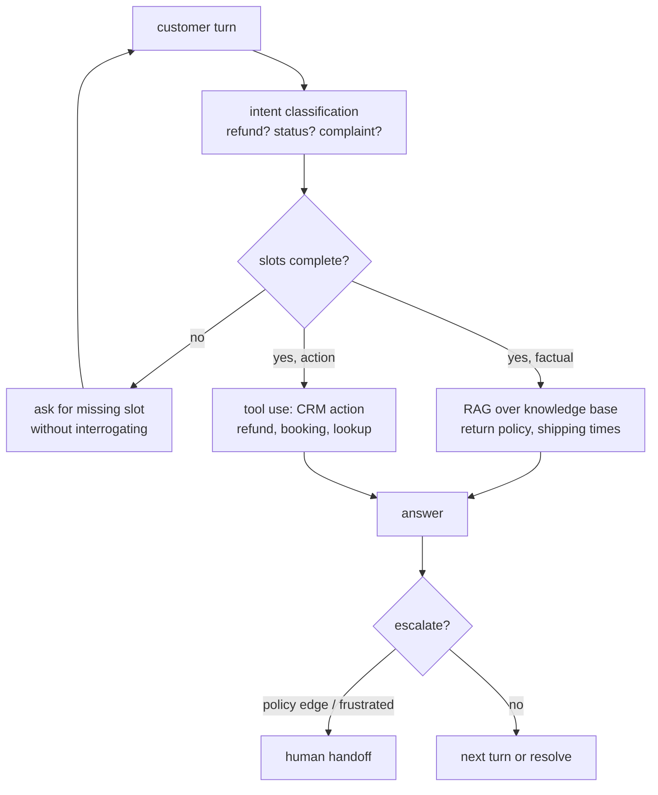
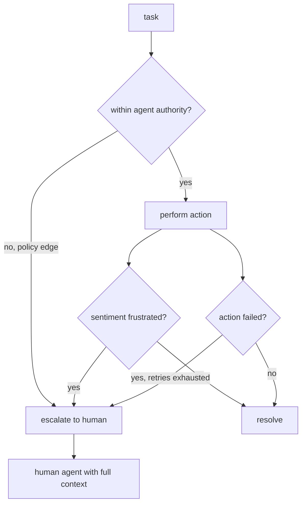
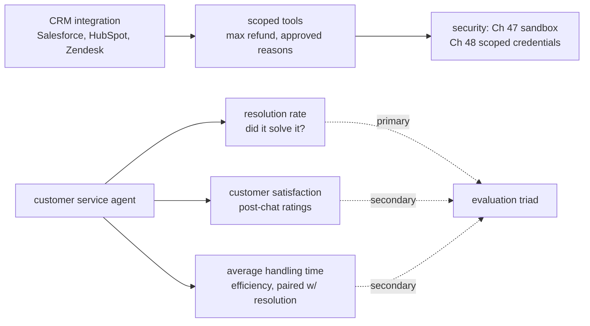

# Chapter 56: Customer Service and Conversational Agents

> **Lead paragraph.** A customer service agent that can answer questions but cannot issue a refund is a search box with a personality. The defining task is the multi-turn, task-oriented conversation: the agent must understand an intent, fill the slots the task requires (order id, reason, amount), pull facts from a knowledge base, and take an action in the CRM (refund, booking, status update) — all while adhering to company policy and knowing when to escalate to a human. The benchmark that captures this is **τ-bench** (Sierra Research, arXiv 2406.12045), which evaluates tool-agent-user interaction in realistic domains; its successor **τ²-bench** (arXiv 2506.07982) adds dual-control — the agent must both act and guide the user. This chapter covers the architecture (intent classification + slot filling, RAG over the knowledge base, tool use for actions, sentiment tracking for escalation), the policy-compliance discipline, and the evaluation triad (resolution rate, customer satisfaction, average handling time). By the end you will understand why the failure mode is policy violation (an agent that refunds too generously is worse than one that escalates), and why escalation is a feature, not a defeat.

---

## 1. The Multi-Turn Task-Oriented Conversation

Customer service is not a single question-and-answer (Chapter 13's RAG); it is a multi-turn dialogue with a goal. The agent must hold the conversation toward a task — issuing a refund, changing a booking, looking up a status — which decomposes into four capabilities:

- **Intent classification** — what does the customer want? (refund, status, complaint). The first turn usually states it, but not always cleanly.
- **Slot filling** — the structured parameters the task requires (order id, refund reason, amount). The agent must ask for missing slots without interrogating the customer.
- **RAG over the knowledge base** — for factual answers (return policy, shipping times) the agent retrieves from company docs, not its parametric memory (which would hallucinate policy).
- **Tool use for actions** — the agent calls CRM tools (refund, booking, lookup) to actually do the thing. This is where the conversation stops being talk and becomes action.



<figcaption>Figure 56.1 — The multi-turn task-oriented conversation. Intent classification routes the turn; slot filling collects the structured parameters the task needs (asking without interrogating); RAG handles factual answers from the knowledge base (not parametric memory, which hallucinates policy); tool use performs the CRM action (refund, booking, lookup) — where talk becomes action. Escalation to a human is a branch, not a failure.</figcaption>

The architecture's core loop is intent → slots → (RAG or tool) → answer, with escalation as an explicit branch. The mistake to avoid is treating it as a chatbot: an agent that chats pleasantly but cannot fill a slot or call a tool is a demo, not a customer service agent. The conversation is a means to a task; the agent's job is to complete it.

---

## 2. τ-bench: The Benchmark for Tool-Agent-User Interaction

**τ-bench** (Yao et al., Sierra Research, arXiv 2406.12045) is the benchmark that made customer-service agent evaluation honest. Instead of single-turn QA, it emulates dynamic multi-turn conversations between a user (simulated by an LLM) and an agent equipped with tools, in realistic domains (retail, airline). The agent must complete the user's task through tool calls while adhering to domain policy — and is scored on whether the task completed *correctly*, not whether the conversation was pleasant.

The successor **τ²-bench** (arXiv 2506.07982) extends this to **dual-control**: the agent must not only act but *guide the user*, because in real service the customer sometimes must take an action (verify a code, confirm a cancellation) and the agent's job is to lead them to it. This captures a failure mode τ-bench missed — an agent that performs its side correctly but leaves the user stranded mid-task.

```mermaid
flowchart LR
  subgraph τ-bench
    USER1[user LLM] <-->|multi-turn| AGENT1[agent + tools]
    AGENT1 --> POL1[adhere to domain policy]
    POL1 --> SCORE1[task complete correctly?]
  end
  subgraph τ²-bench
    USER2[user LLM] <-->|dual-control| AGENT2[agent + tools]
    AGENT2 --> GUIDE[guide user to take<br/>their own action]
    GUIDE --> SCORE2[task + user guided?]
  end
```

<figcaption>Figure 56.2 — τ-bench (arXiv 2406.12045) and τ²-bench (2506.07982). τ-bench evaluates a multi-turn conversation between a simulated user and an agent with tools in realistic domains; the agent is scored on completing the task correctly while adhering to policy. τ²-bench adds dual-control: the agent must also guide the user to take their own action (verify a code, confirm a cancellation), capturing the failure mode where the agent performs its side but leaves the user stranded.</figcaption>

The scoring discipline is what makes τ-bench honest: the task is complete *correctly* or it is not — a refund for the wrong amount, a policy violation, or an abandoned mid-task user all count as failure. This is harder than it looks, because a chatty agent that seems helpful can still fail the task, and a terse one that completes it is scored as success. The benchmark rewards task completion, not conversation quality.

---

## 3. Policy Compliance and Escalation

Two disciplines distinguish a deployable customer-service agent from a chatbot:

**Policy compliance** is adhering to company rules — the refund window, the maximum discount an agent can offer, the script for handling complaints. The failure mode here is not failing to help; it is helping *too much*: an agent that issues refunds beyond policy, grants discounts it should not, or waives fees outside its authority is a liability, not an asset. Policy is encoded (a rules engine or policy-as-code the agent consults before acting), not left to the model's judgment — because the model will tend to please the customer, and pleasing the customer sometimes means violating policy.

**Escalation** is knowing when to hand off to a human: policy edge cases the agent is not authorized to resolve, frustrated customers (detected by sentiment), or tasks the agent attempted and failed. Escalation is a feature, not a defeat — an agent that escalates appropriately is more trustworthy than one that blunders through an edge case. The discipline is the threshold: escalate too rarely and the agent mishandles edge cases; escalate too often and the agent is just an expensive router to humans.



<figcaption>Figure 56.3 — Policy compliance and escalation. The agent checks authority before acting (policy-as-code, not model judgment — the model tends to please the customer, which sometimes means violating policy). Escalation triggers on three conditions: policy edge cases beyond authority, frustrated sentiment, or failed actions with retries exhausted. Escalation is a feature — the human receives full conversation context, not a cold handoff.</figcaption>

The escalation that hands the human *full conversation context* is the difference between a usable and an unusable handoff. A customer who has explained their problem to an agent and is then asked to re-explain it to a human has been failed twice. The agent's job at escalation is to transfer the state, not just the customer.

---

## 4. CRM Integration and the Evaluation Triad

The agent's actions land in real systems — Salesforce, HubSpot, Zendesk — through CRM integrations. This makes the customer-service agent an OS agent (Chapter 12) specialized to business systems: it reads and writes to production databases, which means the security disciplines (Chapter 47 sandboxing, Chapter 48 least-authority credentials) apply directly. A refund tool that the agent can call is a tool that, if misused via prompt injection (Chapter 62), costs the company money — so the tool's authority is scoped (max refund amount, approved reasons only), and the agent does not hold the credential itself.

Evaluation rests on three metrics:

- **Resolution rate** — did the agent solve the problem (the τ-bench task-complete-correctly criterion, at scale)? The primary metric; a polite unresolved conversation is a failure.
- **Customer satisfaction (CSAT)** — post-chat ratings. A leading indicator of churn and brand damage, but noisy and easy to game with flattery.
- **Average handling time (AHT)** — efficiency. An agent that resolves in two turns is cheaper than one that resolves in ten; but a fast wrong answer is worse than a slow right one, so AHT is paired with resolution rate, not optimized alone.



<figcaption>Figure 56.4 — CRM integration and evaluation. Actions land in real systems (Salesforce, HubSpot, Zendesk) through scoped tools (max refund, approved reasons), so the security disciplines apply — the agent does not hold the credential itself. Evaluation is the triad: resolution rate (primary — a polite unresolved conversation is a failure), customer satisfaction (noisy, gameable by flattery), and average handling time (efficiency, paired with resolution — a fast wrong answer is worse than a slow right one).</figcaption>

The triad's interaction is the design tension: resolution rate and AHT pull against each other (fast vs. thorough), and CSAT can be inflated by an agent that flatters rather than solves. The discipline is to weight resolution rate primary and treat CSAT/AHT as secondary checks — an agent that resolves and is reasonably fast and not rude is the target, not one that maximizes any single metric.

---

## 5. Agentic Code Project: A Customer Service Agent with Escalation

This project implements the task-oriented loop: intent classification, slot filling, a knowledge-base lookup (RAG stand-in), a scoped tool (refund with a policy cap), sentiment-based escalation, and full-context handoff. It uses the standard `LLMClient` for classification, slot extraction, and response generation.

```python
import os, json
from dataclasses import dataclass, field
import openai


class LLMClient:
    """OpenAI-compatible client; flips to a local Ollama endpoint."""

    def __init__(self, model="gpt-5.5", use_ollama=False):
        self.model = model
        if use_ollama:
            self.client = openai.OpenAI(
                base_url="http://localhost:11434/v1", api_key="ollama")
        else:
            self.client = openai.OpenAI(api_key=os.getenv("OPENAI_API_KEY"))

    def complete(self, prompt, temperature=0.2, max_tokens=300):
        resp = self.client.chat.completions.create(
            model=self.model,
            messages=[{"role": "user", "content": prompt}],
            temperature=temperature, max_tokens=max_tokens)
        return resp.choices[0].message.content.strip()


# Policy-as-code: the agent consults this, not its own judgment.
MAX_REFUND = 100.0
REFUND_REASONS = {"duplicate", "damaged", "not_received", "cancelled"}


@dataclass
class Conversation:
    turns: list = field(default_factory=list)      # full context for handoff
    intent: str = ""
    slots: dict = field(default_factory=dict)


class CustomerServiceAgent:
    """Intent -> slots -> (RAG or tool) -> answer, with escalation."""

    def __init__(self, llm, knowledge_base):
        self.llm = llm
        self.kb = knowledge_base          # {topic: text}

    def classify_intent(self, utterance):
        prompt = (f"Utterance: {utterance}\n"
                  f"Return JSON: {{'intent': 'refund'|'status'|'policy'|'other',"
                  f" 'sentiment': 'neutral'|'frustrated'}}.")
        raw = self.llm.complete(prompt, temperature=0.0, max_tokens=60)
        try:
            return json.loads(raw)
        except json.JSONDecodeError:
            return {"intent": "other", "sentiment": "neutral"}

    def extract_slots(self, utterance, required):
        prompt = (f"Utterance: {utterance}\nRequired slots: {required}\n"
                  f"Return JSON: slot name -> value or null if missing.")
        raw = self.llm.complete(prompt, temperature=0.0, max_tokens=120)
        try:
            return json.loads(raw)
        except json.JSONDecodeError:
            return {s: None for s in required}

    def lookup(self, topic):
        return self.kb.get(topic, "I don't have that in the knowledge base.")

    def refund(self, order_id, reason, amount):
        """Scoped tool: policy check before action. Not the model's judgment."""
        if reason not in REFUND_REASONS:
            return ("deny", f"reason '{reason}' not in approved list")
        if amount > MAX_REFUND:
            return ("escalate", f"amount {amount} exceeds authority {MAX_REFUND}")
        return ("done", f"refunded {amount} for order {order_id} ({reason})")

    def handle(self, utterance, conv):
        conv.turns.append(utterance)
        info = self.classify_intent(utterance)
        conv.intent, sentiment = info["intent"], info["sentiment"]
        if sentiment == "frustrated":
            return self.escalate(conv, "frustrated customer")
        if conv.intent == "policy":
            slots = self.extract_slots(utterance, ["topic"])
            return self.lookup(slots.get("topic"))
        if conv.intent == "refund":
            slots = self.extract_slots(utterance, ["order_id", "reason", "amount"])
            if any(v is None for v in slots.values()):
                missing = [k for k, v in slots.items() if v is None]
                return f"To process the refund I need: {', '.join(missing)}."
            status, msg = self.refund(**slots)
            if status == "escalate":
                return self.escalate(conv, msg)
            return msg
        return "Let me connect you to the right resource. Could you say more?"

    def escalate(self, conv, reason):
        """Hand off with full context — not a cold transfer."""
        transcript = " | ".join(conv.turns)
        return (f"[ESCALATION — {reason}]\n"
                f"Transcript for human: {transcript}\n"
                f"Intent: {conv.intent}, slots: {conv.slots}")


if __name__ == "__main__":
    llm = LLMClient(use_ollama=True)
    kb = {"return_policy": "Returns within 30 days, original packaging."}
    agent = CustomerServiceAgent(llm, kb)
    conv = Conversation()
    print(agent.handle("I want a refund, order 42, damaged, $40", conv))
    print(agent.handle("I want a refund, order 99, cancelled, $500", conv))
```

Four properties to verify. `classify_intent` returns intent *and* sentiment in one call, so the agent can escalate on frustration before attempting the task. `refund` is policy-as-code: it checks the reason against the approved list and the amount against the cap *before* acting — the model never decides whether a refund is allowed, the policy does. `handle` collects missing slots by name rather than interrogating the customer generically. `escalate` passes the full transcript, intent, and slots to the human — a state transfer, not a cold handoff.

```python
def aht_and_resolution(conversations):
    """Evaluation triad: resolution rate primary, AHT paired with it.
    A fast wrong answer is worse than a slow right one, so report both."""
    resolved = [c for c in conversations if c.get("resolved")]
    resolution_rate = len(resolved) / max(len(conversations), 1)
    turns = [len(c["turns"]) for c in conversations]   # AHT proxy
    aht = sum(turns) / max(len(turns), 1)
    return {"resolution_rate": resolution_rate, "avg_turns": aht}
```

The `aht_and_resolution` helper encodes the evaluation discipline: resolution rate is computed and reported as primary, average turns (AHT proxy) as secondary — never optimized alone, because a fast wrong answer inflates AHT-while-failing. Pairing them is what prevents the metric from being gamed by an agent that resolves quickly by resolving incorrectly.

---

## Summary

- Customer service is a multi-turn task-oriented conversation, not single-turn QA. Four capabilities: intent classification (what does the customer want), slot filling (the structured parameters the task needs, collected without interrogating), RAG over the knowledge base (factual answers from docs, not parametric memory which hallucinates policy), and tool use for actions (refund, booking, lookup — where talk becomes action). The core loop is intent → slots → (RAG or tool) → answer, with escalation as an explicit branch.
- τ-bench (arXiv 2406.12045) is the benchmark for tool-agent-user interaction: a multi-turn conversation between a simulated user and an agent with tools in realistic domains, scored on completing the task *correctly* while adhering to policy. τ²-bench (2506.07982) adds dual-control — the agent must also guide the user to take their own action, capturing the failure mode where the agent performs its side but leaves the user stranded. Scoring rewards task completion, not conversation quality.
- Policy compliance and escalation are the two deployability disciplines. Policy-as-code (the agent consults a rules engine, not its own judgment — the model tends to please the customer, which sometimes means violating policy) caps actions like refunds. Escalation triggers on policy edge cases, frustrated sentiment, or failed actions — and is a feature, not a defeat, provided the human receives full conversation context (a state transfer, not a cold handoff).
- CRM integration (Salesforce, HubSpot, Zendesk) makes the agent an OS agent (Ch 12) specialized to business systems, so Ch 47 sandboxing and Ch 48 scoped credentials apply. The evaluation triad is resolution rate (primary — a polite unresolved conversation is a failure), customer satisfaction (noisy, gameable by flattery), and average handling time (efficiency, paired with resolution — a fast wrong answer is worse than a slow right one). Weight resolution primary; CSAT and AHT are secondary checks.

---

## Further Reading

- [τ-bench: A Benchmark for Tool-Agent-User Interaction in Real-World Domains](https://arxiv.org/abs/2406.12045) — Yao et al., Sierra Research. The customer-service agent benchmark.
- [τ²-bench: Evaluating Conversational Agents in a Dual-Control Setting](https://arxiv.org/abs/2506.07982) — the successor adding user-guidance evaluation.
- [Sierra Research τ-bench](https://github.com/sierra-research/tau2-bench) — code, domains (retail, airline), and leaderboards.
- [Chapter 12 — OS Agents] — the backend-integration foundations customer service agents build on.

---