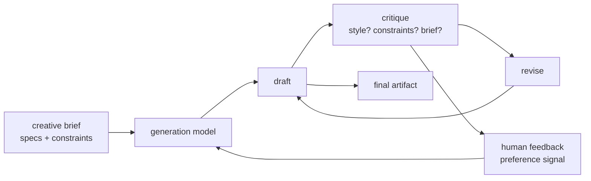
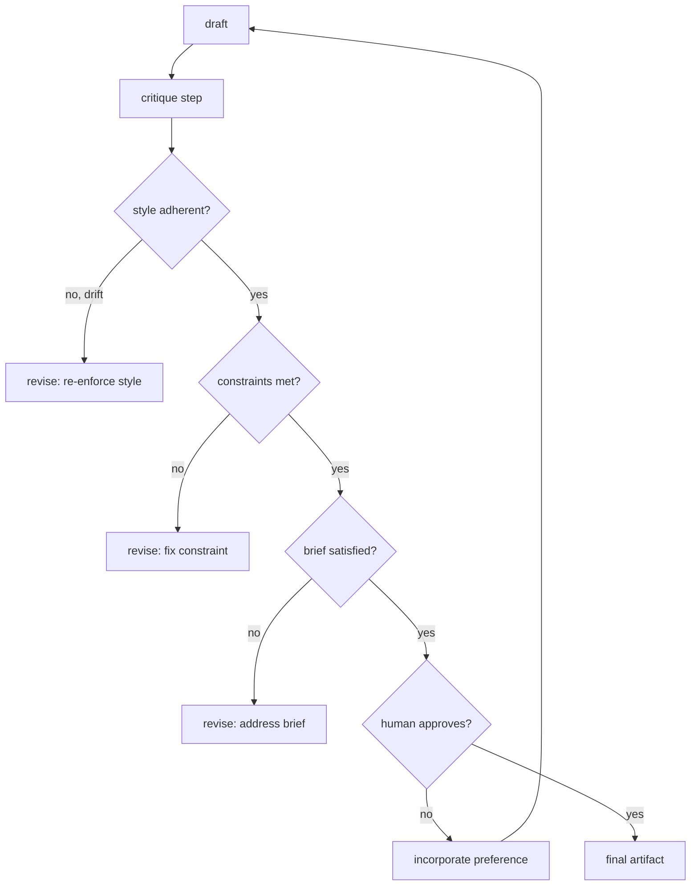
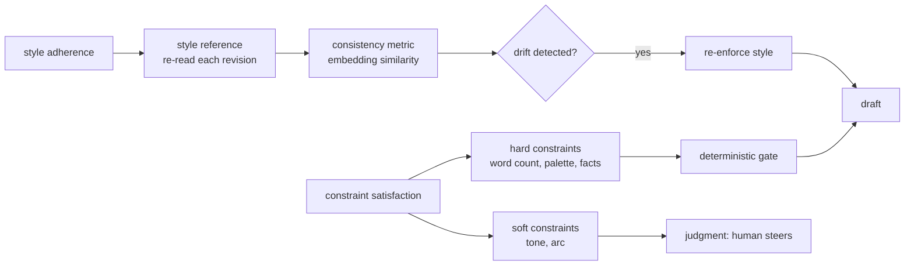
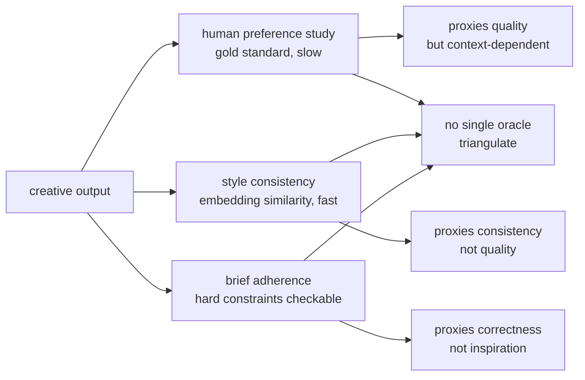

# Chapter 57: Creative Agents

> **Lead paragraph.** A creative agent is not a generator you prompt once and accept; it is a co-creative system that drafts, critiques, and revises alongside a human who steers. Across writing (creative, copy, technical), art (image generation, style transfer, design), and music (composition, arrangement, sound design), the architecture is the same loop: generate → critique → revise, with the human's preference as the signal that converges the loop. This chapter covers the three creative domains and their shared architecture, the two technical problems that distinguish creative agents from one-shot generators (style adherence — keeping a consistent voice or visual style across outputs — and constraint satisfaction — meeting a creative brief's specifications), and the evaluation problem (subjective quality has no oracle, so human preference studies and style-consistency metrics are the proxies). By the end you will understand why "is it good?" is the wrong question for a creative agent (it has no answer without a human), and why iterative refinement with human feedback is the entire point, not an optimization.

---

## 1. The Three Creative Domains

Creative agents span three modalities, each with a generation model and a refinement loop:

- **Writing agents** — creative writing, copywriting, technical writing. The generation model is an LLM; the refinement loop shapes voice, structure, and adherence to a brief. Technical writing adds a constraint: factual accuracy (it is not creative if it hallucinates a spec).
- **Art agents** — image generation, style transfer, design assistance. The generation model is a diffusion model (Stable Diffusion) or proprietary system (Midjourney, OpenAI's image models); the refinement loop shapes composition, style consistency, and brief adherence across a set of images.
- **Music agents** — composition, arrangement, sound design. The generation model is an audio model (Suno, Udio); the refinement loop shapes structure, instrumentation, and the emotional arc a piece should follow.



<figcaption>Figure 57.1 — The co-creative loop, shared across writing, art, and music. A brief (specifications and constraints) drives the generation model to a draft; critique checks style, constraint, and brief adherence; revision refines the draft; human preference is the signal that converges the loop. The human is in the loop, not just at the start — preference steers generation across iterations, which is what makes the system co-creative rather than a one-shot generator.</figcaption>

The shared architecture is the chapter's organizing claim: regardless of modality, a creative agent is a generate-critique-revise loop with a human steering. The differences are in the generation model (LLM, diffusion, audio) and the critique dimensions (voice vs. composition vs. structure), not in the loop.

---

## 2. The Co-Creative Architecture: Iterative Refinement

What makes a system *co-creative* rather than merely generative is iterative refinement with the human in the loop. Three mechanics define it:

- **Generate → critique → revise** — the agent does not stop at the first draft. It critiques its own output (or accepts the human's critique) and revises. The first draft of a creative work is rarely the final one, and an agent that cannot revise is a prompt, not a collaborator.
- **Style adherence** — maintaining a consistent voice (writing) or visual style (art) across outputs and iterations. A creative brief usually specifies a style; the agent must hold it, not drift toward its own default. This is harder than it sounds — models tend to regress to their training mean, and a brief for a terse noir voice becomes verbose across revisions without active enforcement.
- **Constraint satisfaction** — meeting the specifications in the brief (word count, color palette, instrumentation, fact accuracy in technical writing). A creative output that violates a hard constraint is not creative, it is wrong.



<figcaption>Figure 57.2 — The iterative-refinement mechanics. Each draft is critiqued on three dimensions: style adherence (does it hold the specified voice/visual style, or has it drifted toward the model's default), constraint satisfaction (word count, palette, instrumentation, factual accuracy), and brief satisfaction (does it meet the brief at all). Only when all three pass does it reach the human, whose preference either approves or feeds back into generation — the convergence signal for the loop.</figcaption>

The critique ordering matters: style and constraints are checked before brief satisfaction, because a draft that violates a hard constraint cannot be judged on brief adherence — it is wrong first. This is the same discipline as the code agent's failing-test-first (Chapter 53): establish the hard gates before the soft judgment.

---

## 3. Style Adherence and Constraint Satisfaction

The two technical problems that distinguish creative agents from one-shot generators deserve separate treatment, because each is where naive systems fail:

**Style adherence** is consistency across outputs and iterations. In writing, this is voice (a terse noir voice should stay terse across a 2,000-word piece, not drift verbose by paragraph 8). In art, it is visual style (a set of images for a brand should share palette, line weight, and composition rules). The failure mode is regression to the training mean — the model's default, which dilutes the specified style over long outputs. The fix is active re-enforcement: a style vector or reference the agent re-reads each revision, not a one-time instruction it forgets.

**Constraint satisfaction** is meeting the brief's specifications. Hard constraints (word count, color palette, fact accuracy in technical writing) are checkable; soft constraints (tone, emotional arc) are judgment. A creative agent must satisfy the hard constraints deterministically (a 500-word piece that is 800 words is wrong, not creative) and treat the soft ones as the space where the human's preference steers.



<figcaption>Figure 57.3 — Style adherence and constraint satisfaction. Style adherence uses a style reference re-read each revision (not a one-time instruction), measured by a consistency metric (embedding similarity across outputs); drift triggers re-enforcement. Constraint satisfaction splits into hard constraints (word count, palette, fact accuracy — checkable, a deterministic gate) and soft constraints (tone, emotional arc — judgment, the space where the human steers). Models regress to their training mean; active enforcement is what holds the style.</figcaption>

The lesson generalizes: the soft constraints are where co-creation lives. A system that treats everything as a hard constraint is a template filler, not creative; a system that treats everything as soft is a slot machine. The agent's design is to harden what is checkable and leave the rest to the human — which is why the human cannot be removed from the creative loop.

---

## 4. Evaluation: Subjective Quality Has No Oracle

Creative evaluation has no test-suite oracle (unlike Chapter 53's coding agents, where pass/fail is binary). Three approaches are used, each a proxy:

- **Human preference studies** — the gold standard. Present outputs to humans, ask which they prefer, and optimize for preference (the RLHF signal, Chapter 4). Honest but expensive and slow — and subject to the preference's context (what a human prefers in a study may not match what they want in their actual workflow).
- **Style consistency metrics** — embedding similarity across outputs, measuring whether the agent holds a style. Objective and fast, but measures consistency, not quality — a consistently-bad style scores well.
- **Brief-adherence scoring** — does the output meet the brief's stated specifications? Objective for hard constraints, but a brief-satisfying output can still be uninspired.



<figcaption>Figure 57.4 — Creative evaluation has no oracle. Human preference studies are the gold standard but slow and context-dependent; style consistency metrics (embedding similarity) are fast but measure consistency, not quality; brief adherence checks hard constraints but not inspiration. No single metric captures "is it good?" — the answer requires triangulation and, ultimately, a human, which is why the human is in the loop for evaluation as well as generation.</figcaption>

The evaluation gap is the chapter's honesty: "is it good?" has no answer without a human, because good is a preference, not a property. This is why the human in the creative loop is non-removable — not as a limitation to be engineered away, but as the definition of the task. A creative agent that removed the human would be optimizing a proxy for a preference it cannot measure, which is exactly the failure mode Chapter 16's reward-hacking discussion warns against.

---

## 5. Agentic Code Project: A Co-Creative Writing Agent

This project implements the generate → critique → revise loop for a writing agent, with style adherence (a style reference re-read each revision), constraint satisfaction (word count and fact-accuracy gates), and human preference as the convergence signal. It uses the standard `LLMClient` for generation and critique.

```python
import os, json, re
from dataclasses import dataclass, field
import openai


class LLMClient:
    """OpenAI-compatible client; flips to a local Ollama endpoint."""

    def __init__(self, model="gpt-5.5", use_ollama=False):
        self.model = model
        if use_ollama:
            self.client = openai.OpenAI(
                base_url="http://localhost:11434/v1", api_key="ollama")
        else:
            self.client = openai.OpenAI(api_key=os.getenv("OPENAI_API_KEY"))

    def complete(self, prompt, temperature=0.7, max_tokens=600):
        resp = self.client.chat.completions.create(
            model=self.model,
            messages=[{"role": "user", "content": prompt}],
            temperature=temperature, max_tokens=max_tokens)
        return resp.choices[0].message.content.strip()


@dataclass
class Brief:
    topic: str
    style: str            # style reference, re-read each revision
    word_limit: int       # hard constraint
    facts: list = field(default_factory=list)   # must appear (technical writing)


class CreativeWritingAgent:
    """Generate -> critique (style + constraints + brief) -> revise."""

    def __init__(self, llm):
        self.llm = llm

    def generate(self, brief, prev_draft="", critique=""):
        prompt = (f"Brief: {brief.topic}\nStyle: {brief.style}\n"
                  f"Word limit: {brief.word_limit}\n"
                  f"Must include facts: {brief.facts}\n")
        if prev_draft:
            prompt += (f"Previous draft:\n{prev_draft}\n"
                       f"Critique to address:\n{critique}\n")
        prompt += "Write the piece. Hold the style."
        return self.llm.complete(prompt, temperature=0.7)

    def critique(self, brief, draft):
        prompt = (f"Brief: {brief.topic}\nStyle: {brief.style}\n"
                  f"Draft:\n{draft}\n"
                  f"Return JSON: {{'style_adherent': bool, "
                  f"'constraints_met': bool, 'brief_satisfied': bool, "
                  f"'issues': [str]}}.")
        raw = self.llm.complete(prompt, temperature=0.1, max_tokens=200)
        try:
            return json.loads(raw)
        except json.JSONDecodeError:
            return {"style_adherent": True, "constraints_met": True,
                    "brief_satisfied": True, "issues": []}

    def revise(self, brief, draft, issues):
        joined = "; ".join(issues)
        return self.generate(brief, prev_draft=draft, critique=joined)

    def collaborate(self, brief, max_rounds=3):
        draft = self.generate(brief)
        for _ in range(max_rounds):
            c = self.critique(brief, draft)
            if (c["style_adherent"] and c["constraints_met"]
                    and c["brief_satisfied"]):
                return {"draft": draft, "critique": c, "rounds": _ + 1}
            draft = self.revise(brief, draft, c["issues"])
        return {"draft": draft, "critique": c, "rounds": max_rounds}


if __name__ == "__main__":
    llm = LLMClient(use_ollama=True)
    brief = Brief(topic="a lighthouse keeper's last night",
                  style="terse, present-tense, observational",
                  word_limit=300,
                  facts=["the lamp was lit in 1898"])
    agent = CreativeWritingAgent(llm)
    print(agent.collaborate(brief))
```

Three properties to verify. `generate` re-reads the style reference and word limit each call — not a one-time instruction — which is what holds the style against drift. `critique` checks the three dimensions in the order the chapter prescribes (style, constraints, brief), so a constraint violation is caught before a soft brief judgment. `collaborate` loops until all three pass or rounds exhaust, and the human is the final approver (the function returns the draft for human review, not auto-publishes) — the convergence signal is the human's, not the agent's.

```python
def style_consistency(outputs, embed=None):
    """Style adherence metric: embedding similarity across outputs.
    Measures consistency, NOT quality — a consistently-bad style scores well.
    Pair with human preference; never optimize alone."""
    if len(outputs) < 2 or embed is None:
        return 1.0
    vecs = [embed(o) for o in outputs]
    sims = [vecs[i] @ vecs[i + 1] for i in range(len(vecs) - 1)]
    return sum(sims) / max(len(sims), 1)
```

The `style_consistency` helper is the chapter's evaluation honesty in one function: it measures *consistency* (embedding similarity across outputs), explicitly *not* quality, and the docstring says so — a consistently-bad style scores well. Pairing it with human preference (never optimizing it alone) is what prevents the metric from being gamed into consistent mediocrity, the creative-domain analog of Chapter 16's reward-hacking warning.

---

## Summary

- Creative agents span three domains — writing (creative, copy, technical), art (image generation, style transfer, design), and music (composition, arrangement, sound design) — each with a generation model (LLM, diffusion, audio) and a shared architecture: generate → critique → revise with the human steering. The differences are modality-specific; the loop is not.
- The co-creative architecture is iterative refinement with the human in the loop. Three mechanics: generate-critique-revise (the agent does not stop at the first draft), style adherence (holding a consistent voice/visual style across outputs and iterations — models regress to their training mean, so a style reference is re-read each revision), and constraint satisfaction (hard constraints like word count, palette, and fact accuracy are checkable; soft constraints like tone and emotional arc are the human's judgment).
- Style adherence and constraint satisfaction are where naive systems fail. Style drifts toward the model's default without active re-enforcement; hard constraints must be a deterministic gate (a 500-word piece that is 800 words is wrong, not creative), and soft constraints are the space where co-creation lives. The design is to harden what is checkable and leave the rest to the human — which is why the human cannot be removed.
- Creative evaluation has no oracle. Human preference studies (gold standard, slow, context-dependent), style consistency metrics (fast, measure consistency not quality), and brief-adherence scoring (checks hard constraints, not inspiration) are proxies. "Is it good?" has no answer without a human, because good is a preference — so the human in the loop is non-removable, the definition of the task, not a limitation.

---

## Further Reading

- [Midjourney](https://www.midjourney.com/) — image generation and style.
- [Stable Diffusion (Stability AI)](https://stability.ai/) — open diffusion image models.
- [Suno](https://suno.com/) — AI music generation.
- [Chapter 4 — RLHF and Preference Learning] — the preference signal that converges the creative loop.

---