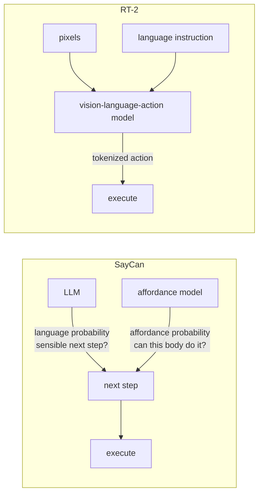
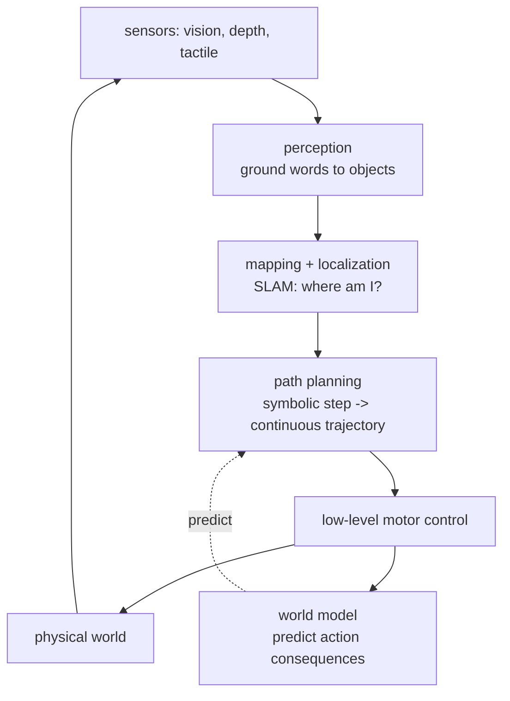
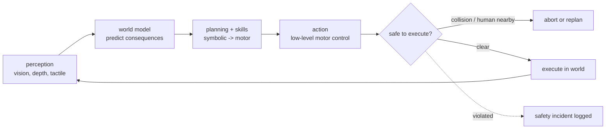
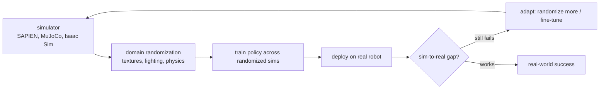

# Chapter 58: Embodied Agents and Robotics

> **Lead paragraph.** An embodied agent does not just produce text; it moves a body in a physical world where actions are irreversible and mistakes cost money or lives. The breakthrough that made language useful for robots was not a bigger model but a grounding trick: **SayCan** (Ahn et al., 2022, arXiv 2204.01691) has an LLM propose the next step and an affordance model — trained on what the robot can actually do — veto the steps it cannot, so language plans but the body decides. **RT-2** (Brohan et al., 2023, arXiv 2307.15818) collapsed the pipeline into a vision-language-action model that maps pixels and text directly to motor commands. This chapter covers language-conditioned control (SayCan, RT-2, RT-X cross-embodiment), the embodied architecture (perception, action, world models, safety), sim-to-real transfer (domain randomization), and evaluation (ALFWorld, ScienceWorld, real-world success/safety/time). By the end you will understand why grounding in affordances is what makes language safe for robots, and why sim-to-real is the central difficulty — the simulator is never quite the world.

---

## 1. Language-Conditioned Robot Control

The naive idea — give a robot an LLM and let it decide actions — fails because language models know what is *plausible* but not what is *affordable* (what this body, in this pose, can actually do). Two architectures solved this:

- **SayCan** (Ahn et al., 2022, arXiv 2204.01691) — the LLM proposes the next step in natural language ("pick up the can"), and a separate affordance model scores whether the robot can execute it given its current state. The final choice is the product of language probability (is this a sensible next step?) and affordance probability (can the robot do it?). Language plans; the body decides.
- **RT-2** (Brohan et al., 2023, arXiv 2307.15818) — a vision-language-action (VLA) model that maps pixels and a language instruction directly to a tokenized action, end-to-end. No separate planner and affordance model; the whole pipeline is one model co-trained on web data (for language/vision) and robot data (for action).



<figcaption>Figure 58.1 — Two language-conditioned architectures. SayCan (arXiv 2204.01691): the LLM proposes a next step scored by language probability, an affordance model scores whether the robot can execute it, and the product is the chosen step — language plans, the body decides. RT-2 (2307.15818): a vision-language-action model maps pixels and a language instruction directly to a tokenized action, collapsing the pipeline into one co-trained model. Grounding in affordances is what makes language safe for robots.</figcaption>

The difference is a design tradeoff: SayCan's separation keeps the affordance model auditable (you can see why a step was vetoed) and lets the planner swap (any LLM); RT-2's integration learns the affordance implicitly from data, which scales but is opaque. **RT-X** (arXiv 2310.08864) extends RT-2 across robot embodiments — the same model controls different bodies, learning a transferable action representation — which is the path to general robot foundation models.

---

## 2. Navigating Physical Spaces

A robot that acts in the world must navigate it, which decomposes into the classical robotics stack integrated with language:

- **Perception** — vision, depth, tactile sensing. The robot builds a representation of the world from sensors; for language-conditioned control, perception must ground words ("the red can") to perceived objects.
- **Mapping and localization** — building a map of the space and knowing where the robot is in it (SLAM). Path planning needs a map; acting needs a location.
- **Path planning** — finding a collision-free route through the map, combining the symbolic plan (the LLM's next step) with motion planning (the continuous trajectory).



<figcaption>Figure 58.2 — Navigation and the embodied stack. Perception (vision, depth, tactile) grounds words to perceived objects; mapping and localization (SLAM) answer "where am I?"; path planning turns a symbolic step into a continuous collision-free trajectory; low-level motor control executes it. A world model predicts the consequences of actions, feeding back into planning — the embodied analog of a model-based agent's lookahead (Ch 22).</figcaption>

The **world model** — predicting the consequences of actions — is what lets the agent *plan* rather than react. A robot without a world model can only execute; one with a world model can simulate ("if I push here, the can falls") and choose. This is Chapter 22's model-based RL specialized to physical dynamics, and it is the bridge between the symbolic plan (language) and the continuous execution (motors).

---

## 3. The Embodied Architecture

Beyond navigation, the embodied agent's architecture has four modules, each a failure surface:

- **Perception modules** — vision, depth, tactile. Embodiment demands multi-modal perception (a robot that only sees cannot handle "is it hot?"). Perception noise propagates: a mis-localized object is a failed grasp.
- **Action modules** — low-level motor control (continuous commands) and high-level skill execution (composed behaviors like "pick and place"). The hierarchy mirrors Chapter 18's hierarchical planning.
- **World models** — predicting action consequences for planning. The better the world model, the less the robot must physically trial-and-error (which is expensive and dangerous in the real world).
- **Safety** — collision avoidance and human proximity detection. Embodiment makes safety non-negotiable: a text agent that errs produces wrong text; a robot that errs breaks something or someone.



<figcaption>Figure 58.3 — The embodied architecture and its safety gate. Perception (multi-modal — vision, depth, tactile) feeds the world model (predict action consequences for planning), which feeds planning and skill execution, which feeds low-level motor control. A safety gate checks collision and human proximity before execution; a violation aborts or replans and logs an incident. Safety is non-negotiable in embodiment — a robot that errs breaks something or someone, unlike a text agent.</figcaption>

The safety gate before execution is the embodied discipline: every planned action is checked for collision and human proximity before it runs, and a violation triggers abort or replan. This is the physical-world analog of Chapter 48's human-in-the-loop approval, except the gate is automatic and the stakes are physical — which is why it is a hard gate, not a soft warning.

---

## 4. Sim-to-Real Transfer

Training a robot in the real world is slow, expensive, and dangerous. The solution is **sim-to-real**: train in simulation (SAPIEN, MuJoCo, Isaac Sim), deploy on the real robot. The central difficulty is that the simulator is never quite the world — lighting, friction, sensor noise, and dynamics all differ — so a policy that works in sim can fail on the real robot.

**Domain randomization** (Tobin et al., 2017, arXiv 1703.06907) is the fix: randomize the simulator's parameters (textures, lighting, physics constants) during training so broadly that the real world becomes just another sample from the distribution. A policy trained across enough randomized sims generalizes to the real world because the real world is within the training distribution.



<figcaption>Figure 58.4 — Sim-to-real transfer. Train in simulation (cheap, safe, fast), deploy on the real robot. The sim-to-real gap — lighting, friction, sensor noise, dynamics differ — is addressed by domain randomization (arXiv 1703.06907): randomize the simulator's parameters so broadly during training that the real world is just another sample. If the policy still fails on the real robot, randomize more or fine-tune. The simulator is never quite the world; domain randomization is how you close the gap.</figcaption>

The loop — randomize, train, deploy, observe failure, randomize more — is the sim-to-real discipline. It is iterative because the gap is empirical: you cannot predict in advance which sim parameters matter for a given task, so you discover them by deploying and seeing what fails. This is the same observe-and-revise loop as the code agent (Chapter 53) and the data analyst (Chapter 55), specialized to physical dynamics.

---

## 5. Agentic Code Project: A SayCan-Style Affordance-Grounded Planner

This project implements SayCan's core idea: an LLM proposes next steps, an affordance model scores whether the robot can execute them given its state, and the product selects the step. It uses the standard `LLMClient` for proposals and a mock affordance model (production trains one on robot trajectories).

```python
import os, json, math
from dataclasses import dataclass, field
import openai


class LLMClient:
    """OpenAI-compatible client; flips to a local Ollama endpoint."""

    def __init__(self, model="gpt-5.5", use_ollama=False):
        self.model = model
        if use_ollama:
            self.client = openai.OpenAI(
                base_url="http://localhost:11434/v1", api_key="ollama")
        else:
            self.client = openai.OpenAI(api_key=os.getenv("OPENAI_API_KEY"))

    def complete(self, prompt, temperature=0.3, max_tokens=300):
        resp = self.client.chat.completions.create(
            model=self.model,
            messages=[{"role": "user", "content": prompt}],
            temperature=temperature, max_tokens=max_tokens)
        return resp.choices[0].message.content.strip()


@dataclass
class RobotState:
    holding: str = ""          # object name or empty
    at: tuple = (0.0, 0.0)     # position
    reachable: list = field(default_factory=list)   # objects within reach


class AffordanceModel:
    """Scores whether the robot can execute a step given its state.
    Production: trained on robot trajectories. Here: rule-based mock."""

    def score(self, step, state):
        step = step.lower()
        if step.startswith("pick up"):
            obj = step.split("pick up")[-1].strip()
            if obj not in state.reachable:
                return 0.0           # not reachable -> cannot pick up
            if state.holding:
                return 0.1            # already holding something
            return 0.9
        if step.startswith("go to"):
            return 0.8                # movement usually affordable
        if step.startswith("place"):
            return 0.9 if state.holding else 0.0
        return 0.2                    # unknown step -> low affordance


class SayCanAgent:
    """LLM proposes; affordance model grounds; product selects."""

    def __init__(self, llm, affordance):
        self.llm = llm
        self.affordance = affordance

    def propose(self, goal, state, history):
        prompt = (f"Goal: {goal}\nRobot state: holding={state.holding}, "
                  f"at={state.at}, reachable={state.reachable}\n"
                  f"History: {history}\n"
                  f"Propose the next step as a short action. One line.")
        return self.llm.complete(prompt, temperature=0.2, max_tokens=40)

    def select(self, goal, state, history, k=3):
        """Top-k language proposals, each scored by affordance,
        product selects — language plans, body decides."""
        prompt = (f"Goal: {goal}\nState: holding={state.holding}, "
                  f"reachable={state.reachable}.\n"
                  f"List {k} possible next steps, one per line.")
        raw = self.llm.complete(prompt, temperature=0.4, max_tokens=80)
        steps = [s.strip("- ").strip() for s in raw.splitlines() if s.strip()]
        scored = [(s, self.affordance.score(s, state)) for s in steps]
        if not scored:
            return None, 0.0
        step, aff = max(scored, key=lambda x: x[1])
        return step, aff

    def run(self, goal, state, max_steps=5):
        history = []
        for _ in range(max_steps):
            step, aff = self.select(goal, state, history)
            if step is None or aff < 0.3:
                history.append(f"[abort: no affordable step]")
                break
            history.append(f"{step} (aff={aff:.2f})")
            # mock execution: mutate state
            if step.lower().startswith("pick up"):
                obj = step.split("pick up")[-1].strip()
                state.holding = obj
        return history


if __name__ == "__main__":
    llm = LLMClient(use_ollama=True)
    state = RobotState(reachable=["red can", "blue cup"])
    agent = SayCanAgent(llm, AffordanceModel())
    print(agent.run("bring me the red can", state))
```

Two properties to verify. `select` computes the product of language probability (the LLM's proposal, ranked) and affordance (the body's veto) — a step the LLM loves but the robot cannot do scores low and is rejected, which is SayCan's grounding principle. `AffordanceModel.score` returns 0 for a pick-up of an unreachable object — the body deciding, not the language — and the `aff < 0.3` abort in `run` stops the agent when no step is affordable, the safety property that prevents a robot from forcing an impossible action.

```python
def safety_gate(planned_action, state, human_positions):
    """Hard gate before execution: abort on collision or human proximity.
    Embodiment makes this non-negotiable — a text agent errs in text;
    a robot errs in the world."""
    if not collision_free(planned_action, state):
        return ("abort", "planned trajectory collides")
    for hp in human_positions:
        if distance(state.at, hp) < SAFE_RADIUS:
            return ("abort", f"human within {SAFE_RADIUS}m")
    return ("execute", "clear")
```

The `safety_gate` helper is the embodied safety discipline in one function: every planned action is checked for collision and human proximity before execution, and a violation returns `abort`, not a warning. The `SAFE_RADIUS` constant is the named-config discipline (Chapter 8) — a magic number externalized so the safety threshold is auditable and adjustable, not buried in a conditional.

---

## Summary

- Language-conditioned robot control grounds language in what the body can do. SayCan (arXiv 2204.01691) has an LLM propose the next step and an affordance model veto what the robot cannot execute — language plans, the body decides. RT-2 (2307.15818) collapses the pipeline into a vision-language-action model mapping pixels and text to tokenized actions. RT-X (2310.08864) extends this across embodiments toward general robot foundation models. Grounding in affordances is what makes language safe for robots.
- Navigating physical spaces integrates the classical robotics stack with language: perception (multi-modal — vision, depth, tactile — grounding words to objects), mapping and localization (SLAM, "where am I?"), and path planning (symbolic step to continuous collision-free trajectory). A world model predicts action consequences, letting the agent plan rather than react — the embodied analog of model-based lookahead (Ch 22).
- The embodied architecture has four modules, each a failure surface: perception (noise propagates to failed grasps), action (low-level motor control and high-level skill execution, mirroring hierarchical planning), world models (predict consequences so the robot need not physically trial-and-error), and safety (collision avoidance and human proximity detection — non-negotiable, because a robot that errs breaks something or someone).
- Sim-to-real is the central difficulty: train in simulation (SAPIEN, MuJoCo, Isaac Sim — cheap, safe, fast), deploy on the real robot, but the simulator is never quite the world. Domain randomization (arXiv 1703.06907) randomizes sim parameters so broadly during training that the real world is just another sample. The loop — randomize, train, deploy, observe failure, randomize more — is the same observe-and-revise discipline as the code and data agents. Evaluation uses ALFWorld and ScienceWorld (simulated embodied tasks) plus real-world success rate, safety incidents, and task completion time.

---

## Further Reading

- [SayCan: Do As I Can, Not As I Say — Grounding Language in Robotic Affordances](https://arxiv.org/abs/2204.01691) — Ahn et al., 2022.
- [RT-2: Vision-Language-Action Models Transfer Web Knowledge to Robotic Control](https://arxiv.org/abs/2307.15818) — Brohan et al., 2023.
- [RT-X: Open-Source Cross-Embodiment Generalization](https://arxiv.org/abs/2310.08864) — cross-embodiment robot foundation models.
- [Domain Randomization for Transferring Deep Neural Networks from Simulation to the Real World](https://arxiv.org/abs/1703.06907) — Tobin et al., 2017.

---