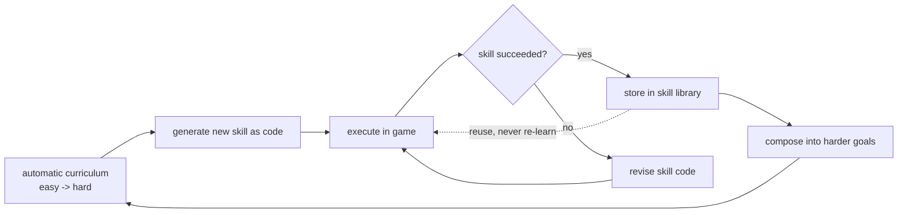
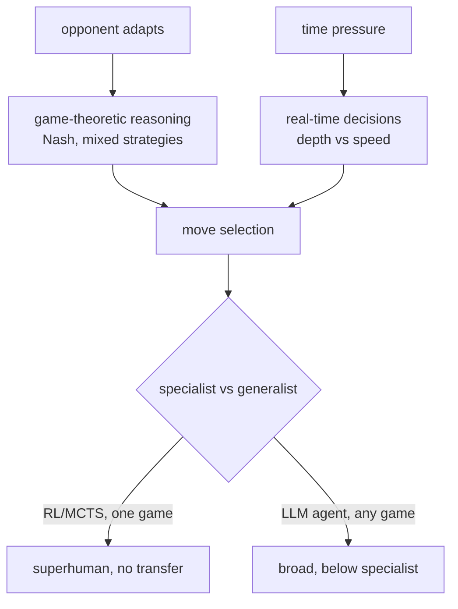
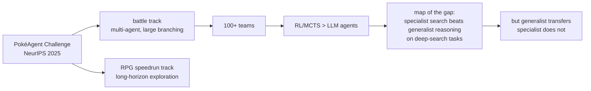
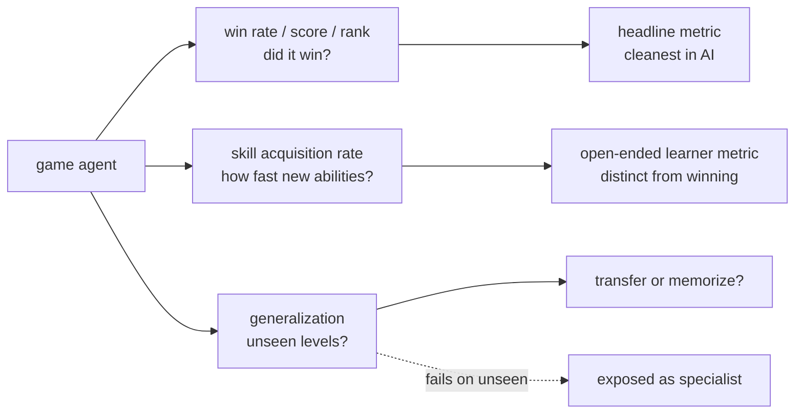

# Chapter 59: Game-Playing Agents

> **Lead paragraph.** Games are the oldest AI benchmark because they offer what the real world refuses: a closed world, clear rewards, and infinite cheap trials. Two threads define modern game agents. The first is open-ended skill acquisition — **Voyager** (Wang et al., 2023, arXiv 2305.16291) plays Minecraft by writing reusable skills as code, storing them in a library, and composing them into ever-harder goals, driven by an automatic curriculum. The second is competitive play, where the **PokéAgent Challenge** (NeurIPS 2025, arXiv 2603.15563) pitted specialist RL/MCTS agents against generalist LLM agents in Pokémon battles — and the specialists won, mapping the gap between systems that overfit a game and systems that reason about one. This chapter covers open-ended learning (skill libraries, curriculum, exploration), competitive agents (game-theoretic reasoning, real-time decisions), and evaluation (win rate, skill acquisition rate, generalization). By the end you will understand why a skill library turns a game agent into a lifelong learner, and why RL beating LLMs in Pokémon is not a setback for agents but a map of where generalist reasoning still falls short.

---

## 1. Open-Ended Skill Acquisition

The first thread — open-ended learning — asks not "can the agent win one game?" but "can it keep acquiring new abilities indefinitely?" **Voyager** (Wang et al., 2023, arXiv 2305.16291) is the canonical system, and its three mechanics define the pattern:

- **Skill libraries** — skills are stored as executable code ("chop wood", "craft planks", "build a boat"), not as weights. A skill once learned is reusable forever, composed into new skills. This is Chapter 38's episodic memory as code: the agent does not re-learn to chop wood each session, it calls the stored skill.
- **Curriculum learning** — easy tasks first, progressively harder, with the curriculum generated automatically from what the agent can currently do. The agent is always at the edge of its ability, which is where learning is fastest.
- **Exploration strategies** — balancing exploration (try something new) and exploitation (use a known skill). Open-ended learning demands exploration, or the agent stalls at its first competent skill.



<figcaption>Figure 59.1 — Open-ended skill acquisition (Voyager, arXiv 2305.16291). An automatic curriculum (easy to hard, generated from current ability) drives the agent to generate a new skill as code, execute it in the game, and verify. Success stores the skill in a library where it is reused forever and composed into harder goals; failure revises the skill code. The skill library is episodic memory as code — the agent never re-learns to chop wood.</figcaption>

The skill-as-code insight is what makes the library composable: because skills are code, the agent can chain them ("chop wood" then "craft planks" then "build a boat") and inspect them ("what skills use planks?"). A library of weights cannot be inspected or composed this way, which is why Voyager's open-ended learning works where a monolithic policy would plateau.

---

## 2. Competitive Game Agents

The second thread — competitive play — tests agents against opponents that adapt, where the right move depends on what the opponent will do. Three capabilities define competitive agents:

- **Game-theoretic reasoning** — in multiplayer games, the optimal strategy depends on the opponent's strategy, modeled via Nash equilibrium and mixed strategies (Chapter 19's MCTS handles the search; game theory handles the strategic interaction). Rock-paper-scissors has no dominant pure strategy; the optimal play is mixed.
- **Real-time decision making** — acting under time pressure. Turn-based games allow search; real-time games force the agent to act before it can search fully, trading depth for speed.
- **Specialist vs. generalist** — the central tension. A specialist (RL/MCTS trained on one game) plays that game at superhuman level but transfers nowhere; a generalist (an LLM agent) reasons about any game but plays each below specialist level.



<figcaption>Figure 59.2 — Competitive game agents. Game-theoretic reasoning (Nash equilibrium, mixed strategies — the right move depends on the opponent) and real-time decision making (depth vs. speed under time pressure) drive move selection. The central tension is specialist vs. generalist: RL/MCTS trained on one game is superhuman but transfers nowhere; an LLM agent reasons about any game but plays each below specialist level — the gap the PokéAgent Challenge maps.</figcaption>

The specialist-generalist gap is the practical question for deploying game agents (and, by analogy, any task-specific agent): do you want superhuman performance on one task, or competent performance on many? The answer is usually domain-specific, and games are the clean place to measure the tradeoff because the benchmark is unambiguous.

---

## 3. The PokéAgent Challenge: Mapping the Gap

The **PokéAgent Challenge** (NeurIPS 2025, arXiv 2603.15563) is the benchmark that mapped the specialist-generalist gap concretely. It built on Pokémon's multi-agent battle system and RPG speedrunning tracks, with 100+ teams competing — and the finding that framed the field: **specialist RL/MCTS agents outperformed generalist LLM agents**.

This is not a setback for LLM agents; it is a map. It shows where generalist reasoning still falls short: in games requiring deep search over a large branching factor (Pokémon battles have combinatorial move/team interactions), the specialist's exhaustive search beats the generalist's heuristic reasoning. But it also shows where the generalist's breadth matters — transferring across game variants, handling novel situations — which the specialist cannot.



<figcaption>Figure 59.3 — The PokéAgent Challenge (NeurIPS 2025, arXiv 2603.15563). Built on Pokémon's battle (multi-agent, large branching factor) and RPG speedrun (long-horizon exploration) tracks, with 100+ teams. The headline finding — specialist RL/MCTS agents outperformed generalist LLM agents — maps the gap: on deep-search tasks, specialist search beats generalist reasoning. This is not a setback for LLM agents but a map of where generalist reasoning falls short (search-heavy games) and where it still leads (transfer across variants, novel situations).</figcaption>

The lesson generalizes beyond games: a generalist agent is not strictly worse than a specialist — it is worse on the specialist's home turf and better everywhere else. Choosing between them is a question of how much of your workload is the home turf. Games let you measure this cleanly because the win/loss is unambiguous; in messy real-world domains (Chapter 55's data analysis, Chapter 56's customer service) the tradeoff is the same but harder to see.

---

## 4. Evaluation

Game evaluation is clean because games give clear signals, but the three metrics capture different things:

- **Win rate, score, rank** — the headline. Did the agent win? Cleanest metric in all of AI, because the game defines success unambiguously.
- **Skill acquisition rate** — how quickly does the agent learn new abilities? Distinct from win rate: an agent that wins one game fast but never learns a new skill has a high win rate and zero skill acquisition (the open-ended learner's metric).
- **Generalization** — performance on unseen game levels. Does the agent transfer, or has it memorized? A specialist that wins on trained levels and fails on unseen ones has not generalized.



<figcaption>Figure 59.4 — Game evaluation's three metrics. Win rate/score/rank is the headline — the cleanest metric in AI, because the game defines success unambiguously. Skill acquisition rate measures how fast the agent learns new abilities, distinct from winning (an agent can win one game fast but never learn a new skill). Generalization tests unseen levels — does the agent transfer, or has it memorized? A specialist that wins on trained levels and fails on unseen ones is exposed as not generalizing.</figcaption>

The three metrics pull apart what a single "is it good?" would conflate: an agent can win (high win rate) without learning (low skill acquisition) or without generalizing (fails on unseen levels). Measuring all three is what tells you whether you have a specialist, an open-ended learner, or a generalizer — three different things that "win rate" alone would label identically.

---

## 5. Agentic Code Project: A Skill-Library Game Agent

This project implements Voyager's core idea: an automatic curriculum drives the agent to generate skills as code, execute and verify them, store successes in a library, and compose them into harder goals. It uses the standard `LLMClient` for skill generation and a mock game environment for execution.

```python
import os, json
from dataclasses import dataclass, field
import openai


class LLMClient:
    """OpenAI-compatible client; flips to a local Ollama endpoint."""

    def __init__(self, model="gpt-5.5", use_ollama=False):
        self.model = model
        if use_ollama:
            self.client = openai.OpenAI(
                base_url="http://localhost:11434/v1", api_key="ollama")
        else:
            self.client = openai.OpenAI(api_key=os.getenv("OPENAI_API_KEY"))

    def complete(self, prompt, temperature=0.4, max_tokens=300):
        resp = self.client.chat.completions.create(
            model=self.model,
            messages=[{"role": "user", "content": prompt}],
            temperature=temperature, max_tokens=max_tokens)
        return resp.choices[0].message.content.strip()


class GameEnvironment:
    """Mock Minecraft-like environment: skills are code strings that
    mutate a state dict. Production wraps the real game API."""

    def __init__(self):
        self.state = {"wood": 0, "planks": 0, "boat": 0}

    def execute(self, skill_code):
        local = dict(self.state)
        try:
            exec(skill_code, {}, local)        # demo only; sandbox in prod (Ch 47)
            self.state = {k: local.get(k, v) for k, v in self.state.items()}
            return True
        except Exception:
            return False


@dataclass
class SkillLibrary:
    """Episodic memory as code: stored skills are reusable forever."""
    skills: dict = field(default_factory=dict)   # name -> code

    def add(self, name, code):
        self.skills[name] = code

    def compose(self, goal, llm):
        if not self.skills:
            return None
        prompt = (f"Goal: {goal}\nAvailable skills: {list(self.skills)}\n"
                  f"Return a plan: which skills in what order, one per line.")
        return llm.complete(prompt, temperature=0.2, max_tokens=100)


class VoyagerAgent:
    """Curriculum -> generate skill as code -> execute -> verify -> store."""

    def __init__(self, llm, env):
        self.llm = llm
        self.env = env
        self.library = SkillLibrary()

    def curriculum_goal(self):
        """Easy -> hard, generated from current state."""
        if not self.library.skills:
            return "gather wood"
        if self.env.state.get("wood", 0) > 0 and "craft_planks" not in self.library.skills:
            return "craft planks from wood"
        return "build a boat from planks"

    def generate_skill(self, goal):
        prompt = (f"Goal: {goal}\nState: {self.env.state}\n"
                  f"Write a Python function body that mutates the `state` "
                  f"dict to achieve the goal. Use state[k] = ... . "
                  f"Only the body, no def line.")
        return self.llm.complete(prompt, temperature=0.2, max_tokens=120)

    def run(self, rounds=3):
        history = []
        for _ in range(rounds):
            goal = self.curriculum_goal()
            code = self.generate_skill(goal)
            ok = self.env.execute(code)
            if ok:
                self.library.add(goal.replace(" ", "_"), code)
                history.append(f"{goal}: learned (state={self.env.state})")
            else:
                history.append(f"{goal}: failed, will revise")
        return history


if __name__ == "__main__":
    llm = LLMClient(use_ollama=True)
    agent = VoyagerAgent(llm, GameEnvironment())
    print(agent.run(rounds=3))
    print("library:", list(agent.library.skills))
```

Three properties to verify. `curriculum_goal` picks the next goal from current state — easy first (gather wood), then harder (craft planks, build a boat) — the automatic curriculum that keeps the agent at the edge of its ability. `generate_skill` produces executable code, not weights, which is what makes the library composable and inspectable. `SkillLibrary.add` stores successes permanently, so a skill learned once is reused forever — the episodic-memory-as-code property that distinguishes an open-ended learner from a policy that plateaus.

```python
def skill_acquisition_rate(library_snapshots):
    """New skills per round: the open-ended learner's metric, distinct
    from win rate. An agent can win one game fast but never learn a new
    skill — high win rate, zero acquisition."""
    counts = [len(s) for s in library_snapshots]
    gains = [counts[i] - counts[i - 1] for i in range(1, len(counts))]
    return sum(gains) / max(len(gains), 1)
```

The `skill_acquisition_rate` helper is the chapter's evaluation honesty: it measures new skills per round — *not* win rate — and the docstring states why: an agent can win one game fast without ever learning a new skill, which high win rate would hide. This is the metric that tells you whether you have an open-ended learner (rising) or a stalled policy (flat), the distinction "is it good?" conflates.

---

## Summary

- Open-ended skill acquisition asks whether an agent can keep learning new abilities indefinitely. Voyager (arXiv 2305.16291) defines the pattern with three mechanics: skill libraries (skills stored as executable code, reusable forever and composable — episodic memory as code, Ch 38), curriculum learning (easy to hard, generated automatically from current ability, keeping the agent at the edge of its competence), and exploration strategies (balancing new and known). The skill-as-code insight is what makes the library composable and inspectable, where a monolithic policy would plateau.
- Competitive game agents test reasoning against adapting opponents. Game-theoretic reasoning (Nash equilibrium, mixed strategies — the right move depends on the opponent) and real-time decision making (depth vs. speed under time pressure) drive move selection. The central tension is specialist vs. generalist: RL/MCTS trained on one game is superhuman but transfers nowhere; an LLM agent reasons about any game but plays each below specialist level.
- The PokéAgent Challenge (NeurIPS 2025, arXiv 2603.15563) mapped the specialist-generalist gap: 100+ teams competed on Pokémon's battle and RPG-speedrun tracks, and specialist RL/MCTS agents outperformed generalist LLM agents. This is not a setback for LLM agents but a map — on deep-search tasks, specialist search beats generalist reasoning; on transfer across variants and novel situations, the generalist still leads. The tradeoff is domain-specific; games let you measure it cleanly.
- Game evaluation is the cleanest in AI because games define success unambiguously, but three metrics pull apart what "is it good?" conflates: win rate/score/rank (the headline), skill acquisition rate (how fast new abilities — distinct from winning; an agent can win one game fast but never learn), and generalization (unseen levels — transfer or memorize). Measuring all three distinguishes a specialist, an open-ended learner, and a generalizer.

---

## Further Reading

- [Voyager: An Open-Ended Embodied Agent with Large Language Models](https://arxiv.org/abs/2305.16291) — Wang et al., 2023. Skill libraries and automatic curriculum in Minecraft.
- [The PokéAgent Challenge: Competitive and Long-Context Learning](https://arxiv.org/abs/2603.15563) — NeurIPS 2025 competition; specialist vs. generalist gap.
- [PokéAgent Challenge](https://pokeagent.github.io/) — competition tracks and results.
- [Chapter 19 — Monte Carlo Tree Search] — the search specialist game agents use.

---