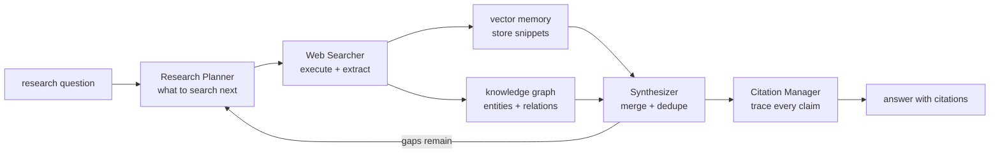
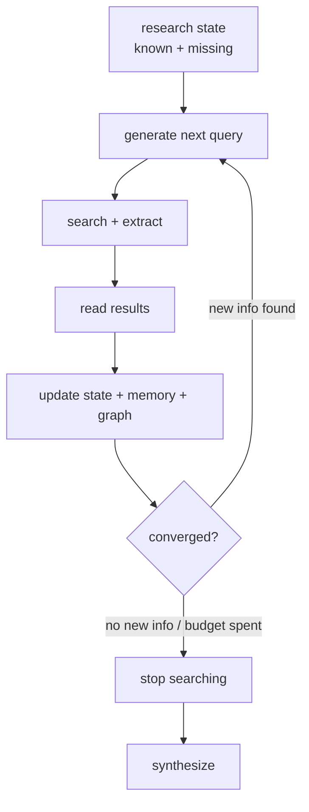
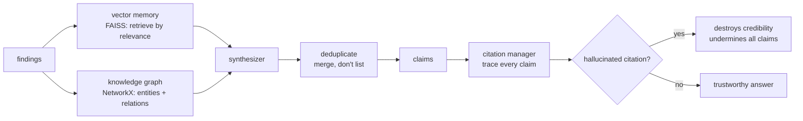

# Chapter 60: Project — Building a Deep Research Agent

> **Lead paragraph.** Deep research agents — OpenAI Deep Research (February 2025), Gemini Deep Research, Perplexity, Elicit — answer questions that no single web page answers, by searching, reading, deciding what to search next, and synthesizing across sources with citations. This Part VII capstone builds one from scratch: a four-component architecture (Research Planner → Web Searcher → Synthesizer → Citation Manager) with iterative search, vector memory for retrieval during synthesis, and a knowledge graph for tracking entities across sources. The project draws on every chapter in Part VII — the literature agent's multi-step search (Ch 54), the data agent's grounded reasoning (Ch 55), the conversational agent's loop (Ch 56), the creative agent's critique (Ch 57) — and the foundations of RAG (Ch 13) and web agents (Ch 11). By the end you will have a working deep-research loop, and you will understand why iterative search (not one-shot retrieval) is the key, why synthesis requires deduplication (not listing), and why citation accuracy is the trust foundation — hallucinated citations destroy credibility.

---

## 1. What a Deep Research Agent Does

A deep research agent answers questions that require synthesizing across many sources — "what is the state of X as of mid-2026?" — by doing what a human researcher does: search, read, refine the query from gaps, search again, and write up findings with citations. The defining property is **iteration**: a one-shot retrieval (Chapter 13's basic RAG) misses what a researcher finds by following a thread, so the agent searches, reads, and searches again with refined queries.

Four capabilities compose the agent:

- **Research planning** — deciding what to search for next, based on what is known and what is missing. This is the agent's reasoning over the research state.
- **Web search and extraction** — executing searches and extracting content from pages (Chapter 11's web-agent foundations).
- **Synthesis** — combining information from multiple sources, with deduplication (sources that say the same thing are merged, not listed).
- **Citation management** — attributing every claim to a specific source, so the answer is traceable and verifiable.



<figcaption>Figure 60.1 — The deep research agent. A research question drives the Research Planner (what to search next), which drives the Web Searcher (execute and extract). Findings go to vector memory (for retrieval during synthesis) and a knowledge graph (entities and relations across sources). The Synthesizer merges and deduplicates; the Citation Manager traces every claim to a source. Gaps feed back to the planner — the iterative loop that distinguishes deep research from one-shot retrieval.</figcaption>

The feedback from synthesis back to planning is the iteration: when the synthesizer finds gaps (claims unsupported, contradictions unresolved, entities with no relation), it tells the planner what to search next. A research agent without this loop is a search-engine summarizer; with it, the agent *researches*.

---

## 2. Iterative Search and the Planner

Iterative search is the key — do not search once and answer. The planner maintains a research state (what is known, what is missing) and generates the next query to fill a gap. Three mechanics:

- **Query refinement from gaps** — after reading results, the planner identifies what is missing and refines the query. This is the literature agent's multi-step search (Chapter 54) applied to the web.
- **Deciding when to stop** — the agent must know when it has enough. Stopping too early yields a shallow answer; stopping too late wastes budget. The signal is convergence: when new searches stop adding new information.
- **Budget governance** — research costs money (Chapter 50); the planner respects a search budget, trading depth for cost.



<figcaption>Figure 60.2 — Iterative search. The planner maintains a research state (known and missing), generates a query to fill a gap, searches and extracts, reads, and updates state, memory, and graph. Convergence — when new searches stop adding new information, or the budget is spent — triggers stop and synthesis. Query refinement from gaps is the literature agent's multi-step search (Ch 54) applied to the web; budget governance (Ch 50) trades depth for cost.</figcaption>

The convergence signal is the planner's hardest judgment: distinguishing "nothing new because I have searched enough" from "nothing new because my queries are bad." The former means stop; the latter means rephrase. A good planner does both — it stops on genuine convergence but rephrases before concluding a gap is unfillable.

---

## 3. Synthesis, Memory, and Citation

Three components handle the findings:

- **Vector memory** (FAISS) — stores article snippets as embeddings, retrieved by relevance during synthesis. This is RAG (Chapter 13) at research scale: the agent does not hold all findings in context, it retrieves the relevant ones.
- **Knowledge graph** (NetworkX) — tracks entities and their relationships across sources, enabling structured reasoning ("A causes B, per source 1; B causes C, per source 2; therefore A→C"). The graph is what lets the agent reason across sources rather than list them.
- **Citation manager** — attributes every claim to a specific source. Citation accuracy is the trust foundation: a hallucinated citation (a URL that does not support the claim, or does not exist) destroys credibility more thoroughly than a wrong answer, because it undermines every other claim.



<figcaption>Figure 60.3 — Synthesis, memory, and citation. Findings go to vector memory (FAISS — retrieve by relevance during synthesis, not hold all in context) and the knowledge graph (NetworkX — entities and relations across sources, for structured reasoning). The synthesizer deduplicates (merges sources that say the same thing, rather than listing them). The citation manager traces every claim to a source; a hallucinated citation destroys credibility more thoroughly than a wrong answer, because it undermines every other claim.</figcaption>

The deduplication discipline is what separates synthesis from listing: when three sources say "X costs $5," the synthesis says "$5 (sources 1, 2, 3)," not "$5 per source 1; $5 per source 2; $5 per source 3." A research report that lists rather than merges reads as padded and unanalyzed, which is the failure mode the synthesizer must avoid.

---

## 4. The Full Project

This project implements the four-component deep-research loop with iterative search, vector memory (a simple embedding stand-in), a knowledge graph, and citation tracing. It uses the standard `LLMClient` for planning, synthesis, and citation, with a mock searcher (production plugs in a real search API).

```python
import os, json, hashlib
from dataclasses import dataclass, field
from collections import defaultdict
import openai


class LLMClient:
    """OpenAI-compatible client; flips to a local Ollama endpoint."""

    def __init__(self, model="gpt-5.5", use_ollama=False):
        self.model = model
        if use_ollama:
            self.client = openai.OpenAI(
                base_url="http://localhost:11434/v1", api_key="ollama")
        else:
            self.client = openai.OpenAI(api_key=os.getenv("OPENAI_API_KEY"))

    def complete(self, prompt, temperature=0.3, max_tokens=500):
        resp = self.client.chat.completions.create(
            model=self.model,
            messages=[{"role": "user", "content": prompt}],
            temperature=temperature, max_tokens=max_tokens)
        return resp.choices[0].message.content.strip()


@dataclass
class Source:
    url: str
    title: str
    snippet: str


class MockSearcher:
    """Stand-in for a real search API. Production uses SerpAPI / Bing /
    DuckDuckGo and a content extractor (Ch 11)."""

    def __init__(self, corpus):
        self.corpus = corpus      # list[Source]

    def search(self, query, k=3):
        scored = [(s, sum(w.lower() in s.snippet.lower()
                         for w in query.split())) for s in self.corpus]
        return [s for s, sc in sorted(scored, key=lambda x: -x[1])[:k] if sc > 0]


class VectorMemory:
    """Retrieve relevant snippets during synthesis (RAG at research scale).
    Demo: lexical; production uses FAISS + embeddings (Ch 36)."""

    def __init__(self):
        self.items = []      # (Source, snippet)

    def add(self, source):
        self.items.append(source)

    def retrieve(self, query, k=3):
        scored = [(s, sum(w.lower() in s.snippet.lower()
                          for w in query.split())) for s in self.items]
        return [s for s, sc in sorted(scored, key=lambda x: -x[1])[:k] if sc > 0]


class KnowledgeGraph:
    """Entities and relations across sources, for structured reasoning."""

    def __init__(self):
        self.edges = defaultdict(set)   # (subject, relation) -> {objects}

    def add(self, subject, relation, obj):
        self.edges[(subject, relation)].add(obj)

    def chains(self, entity):
        return {rel: objs for (s, rel), objs in self.edges.items()
                if s == entity}


class DeepResearchAgent:
    """Planner -> Searcher -> Memory/Graph -> Synthesizer -> Citations."""

    def __init__(self, llm, searcher):
        self.llm = llm
        self.searcher = searcher
        self.memory = VectorMemory()
        self.graph = KnowledgeGraph()

    def plan_query(self, question, known):
        prompt = (f"Question: {question}\nKnown so far: {known}\n"
                  f"What should I search for next to fill a gap? "
                  f"One query, one line. If enough is known, say 'DONE'.")
        raw = self.llm.complete(prompt, temperature=0.2, max_tokens=60)
        return raw.strip()

    def search_and_store(self, query):
        for src in self.searcher.search(query):
            self.memory.add(src)

    def synthesize(self, question):
        sources = self.memory.retrieve(question, k=5)
        bodies = "\n\n".join(f"[{i}] {s.title}: {s.snippet}"
                             for i, s in enumerate(sources))
        prompt = (f"Question: {question}\nSources:\n{bodies}\n"
                  f"Synthesize an answer. Deduplicate (merge, don't list). "
                  f"Cite every claim as [i]. State limitations.")
        return self.llm.complete(prompt, temperature=0.3, max_tokens=600), sources

    def research(self, question, max_rounds=4):
        known = ""
        for _ in range(max_rounds):
            query = self.plan_query(question, known)
            if query.upper().strip() == "DONE":
                break
            self.search_and_store(query)
            known = self.synthesize(question)[0][:300]
        answer, sources = self.synthesize(question)
        return {"answer": answer, "sources": sources,
                "graph_chains": {s.url: self.graph.chains(s.title)
                                 for s in sources}}


if __name__ == "__main__":
    llm = LLMClient(use_ollama=True)
    corpus = [
        Source("https://example.com/a", "Agentic AI", "Agentic AI systems "
               "plan, use tools, and act autonomously toward goals."),
        Source("https://example.com/b", "Tool use", "Tool use lets agents "
               "call functions to extend their capabilities."),
        Source("https://example.com/c", "Planning", "Planning decomposes "
               "goals into subtasks for execution."),
    ]
    agent = DeepResearchAgent(llm, MockSearcher(corpus))
    out = agent.research("What is agentic AI and how does it work?")
    print(out["answer"])
    print("sources:", [s.url for s in out["sources"]])
```

Four properties to verify. `plan_query` returns `DONE` when the planner judges enough is known — the convergence signal that stops iteration, with `known` fed back so the planner sees what it has. `synthesize` explicitly instructs deduplication and citation as `[i]` — the merge-don't-list discipline and the trace-every-claim discipline encoded in the prompt. `VectorMemory.retrieve` selects relevant snippets rather than holding all findings in context — RAG at research scale. The `max_rounds` budget bounds the iteration — budget governance (Chapter 50) trading depth for cost.

```python
def verify_citations(answer, sources):
    """Citation accuracy = the trust foundation. Every [i] in the answer
    must map to a real source, and the source must support the claim.
    Hallucinated citations destroy credibility more than wrong answers."""
    cited = set()
    for token in answer.split():
        token = token.strip("[]")
        if token.isdigit():
            cited.add(int(token))
    valid = {i for i in range(len(sources))}
    hallucinated = cited - valid
    return {"cited_indices": sorted(cited),
            "hallucinated": sorted(hallucinated),
            "trustworthy": len(hallucinated) == 0}
```

The `verify_citations` helper is the chapter's trust discipline in one function: it checks that every `[i]` citation in the answer maps to a real source index, flagging hallucinated citations. The `trustworthy` flag is the binary gate — a single hallucinated citation fails it, because one fabricated source undermines the credibility of every other claim in the answer. This is the anti-sycophancy principle (verify before validating) applied to the agent's own output.

---

## Summary

- A deep research agent answers questions no single web page answers, by searching, reading, refining the query from gaps, and synthesizing across sources with citations. The defining property is iteration — one-shot retrieval (Ch 13's basic RAG) misses what a researcher finds by following a thread. Four capabilities compose it: research planning (what to search next), web search and extraction (Ch 11 foundations), synthesis (merge across sources), and citation management (trace every claim).
- Iterative search is the key. The planner maintains a research state (known and missing), generates a query to fill a gap, searches, reads, and updates state, memory, and graph. Convergence — when new searches stop adding new information, or the budget is spent — triggers stop. The hardest judgment is distinguishing "nothing new because enough" from "nothing new because bad queries"; a good planner stops on genuine convergence but rephrases before concluding a gap is unfillable.
- Synthesis, memory, and citation handle the findings. Vector memory (FAISS) retrieves relevant snippets during synthesis (RAG at research scale — not all findings in context). The knowledge graph (NetworkX) tracks entities and relations across sources for structured reasoning. The synthesizer deduplicates (merges sources that say the same thing — synthesis is not listing). The citation manager traces every claim to a source; a hallucinated citation destroys credibility more thoroughly than a wrong answer, because it undermines every other claim.
- The project implements the four-component loop with iterative search, vector memory, a knowledge graph, and citation tracing. `plan_query` returns DONE on convergence; `synthesize` enforces deduplication and `[i]` citation; `VectorMemory.retrieve` selects rather than holding all in context; `max_rounds` bounds the budget. `verify_citations` is the trust gate — one hallucinated citation fails it, the anti-sycophancy principle applied to the agent's own output.

---

## Further Reading

- [OpenAI Deep Research](https://openai.com/index/introducing-deep-research/) — the February 2025 product that named the category.
- [Perplexity](https://www.perplexity.ai/) — answer-engine with citations.
- [Elicit](https://elicit.org/) — deep research for scientific literature.
- [Chapter 13 — RAG Agents] — the iterative-retrieval foundations deep research extends.

---