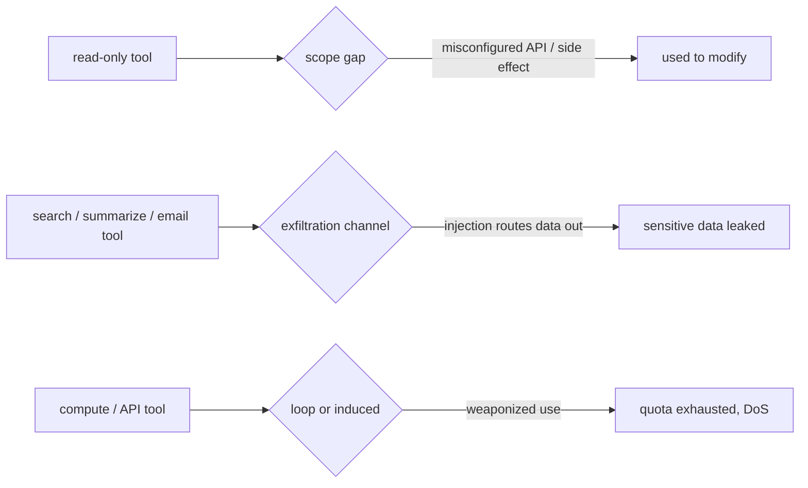
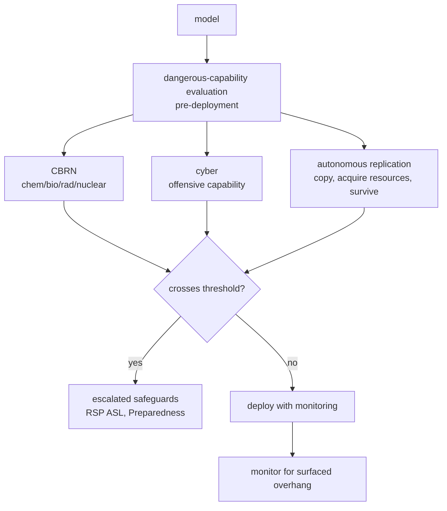
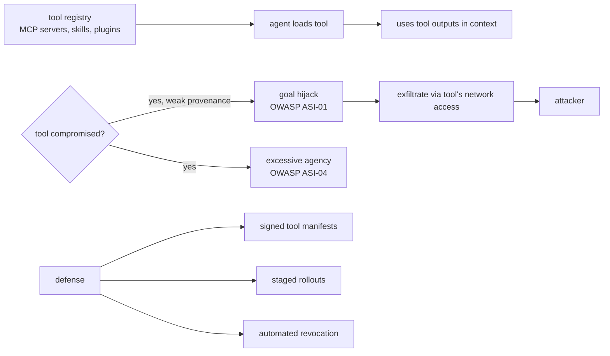
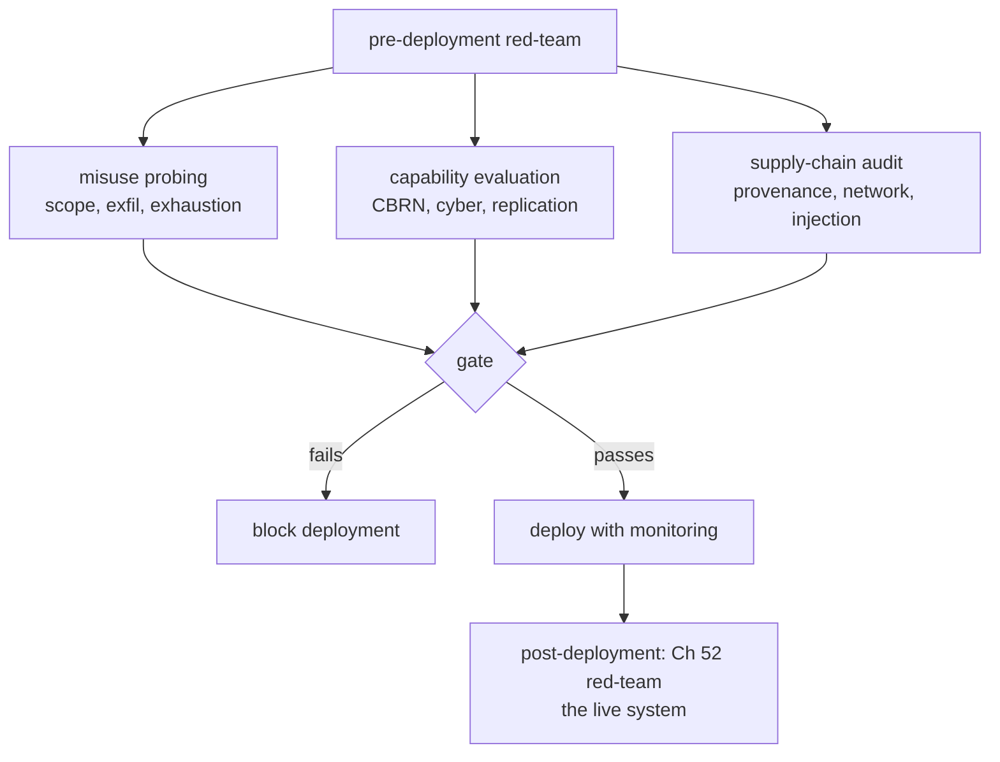

# Chapter 63: Tool Misuse and Capability Abuse

> **Lead paragraph.** Prompt injection (Chapter 62) is about making the agent do the attacker's bidding; tool misuse is about the agent using the tools it was *legitimately* given in unintended ways — a read-only tool used to modify, a search tool used to exfiltrate, a compute tool used to exhaust quotas. The two are related but distinct: injection subverts intent, misuse abuses capability. The framing that captures both is **capability overhang** — the agent can do more than its deployment assumes, and an adversary or a misalignment can surface the overhang. This chapter covers the misuse scenarios (exceeding permission scopes, data exfiltration, resource exhaustion), the dangerous-capability evaluations that gate deployment (CBRN, cyber, autonomous replication, per Anthropic's Responsible Scaling Policy and OpenAI's Preparedness Framework v2, April 2025), and the supply-chain threat (compromised MCP servers, skills, and plugins hijacking agent goals — OWASP ASI-01, ASI-04). By the end you will understand why pre-deployment red-teaming is non-negotiable, and why signed tool manifests and automated revocation are the supply-chain defense — an agent is only as trustworthy as the tools it composes.

---

## 1. Tool Misuse Scenarios

Three misuse forms define the surface, each a legitimate tool used illegitimately:

- **Exceeding permission scopes** — a read-only tool used for modification. The tool was scoped to read; the agent (or an injection) finds a path to write through it — a misconfigured API, a side effect of a "read" call, a chained tool that elevates. The misuse is not a bug in the tool but a gap between the tool's *intended* scope and its *actual* affordances.
- **Data exfiltration** — using tool outputs to leak sensitive information. A search tool, a summarization tool, a "send an email" tool — any tool that moves data out can be turned into an exfiltration channel. The agent retrieves sensitive data legitimately, then an injection routes it to an attacker-controlled endpoint through a tool the agent was given for benign purposes.
- **Resource exhaustion** — agents consuming excessive compute or API quotas. An agent stuck in a loop, or an adversary inducing one, burns budget (Chapter 50's cost explosion as an attack vector). Resource exhaustion is the denial-of-service form of tool misuse: the tool works as intended, but its use is weaponized to exhaust the system.



<figcaption>Figure 63.1 — Tool misuse scenarios. Exceeding permission scopes (a read-only tool used to modify via a scope gap — misconfigured API, side effect, chained elevation), data exfiltration (a legitimate data-moving tool — search, summarize, email — turned into a leak channel by injection routing data out), and resource exhaustion (compute/API tools weaponized to burn budget — the denial-of-service form). Each is a legitimate tool used illegitimately, not a bug in the tool.</figcaption>

The common thread: misuse exploits the gap between a tool's *intended* use and its *actual* affordances. A tool that can read and that happens to also write (through a side effect) has an affordance its scope did not intend. Closing this gap is the discipline of least privilege (Chapter 48) applied at the tool level — scope tools to their actual affordances, not their intended uses, because the agent will use the affordances.

---

## 2. Capability Overhang and Dangerous-Capability Evaluation

**Capability overhang** is the gap between what a model can do and what its deployment assumes. A model deployed for summarization that can also write exploit code has an overhang; if an adversary or misalignment surfaces that capability, the deployment's threat model did not account for it. The overhang is the reason deployment decisions must be grounded in **dangerous-capability evaluation**, not in the model's primary use case.

Two frameworks gate deployment on these evaluations:

- **Anthropic's Responsible Scaling Policy (RSP)** — defines capability levels (ASL, AI Safety Levels) and the evaluations required to clear each. A model that crosses a capability threshold (e.g., ability to materially assist CBRN) triggers escalated safeguards before deployment.
- **OpenAI's Preparedness Framework v2** (April 2025) — a structured evaluation across risk categories, with deployment decisions tied to the results.

The evaluation categories are the same across frameworks: **CBRN** (chemical, biological, radiological, nuclear), **cyber** (offensive capability), and **autonomous replication** (could the model copy itself, acquire resources, survive shutdown). These are the capabilities whose overhang is catastrophic, so they are evaluated before deployment, not after an incident.



<figcaption>Figure 63.2 — Capability overhang and dangerous-capability evaluation. A model's deployment must be gated on pre-deployment evaluation of dangerous capabilities — CBRN, cyber, autonomous replication — the capabilities whose overhang is catastrophic. Anthropic's RSP (ASL thresholds) and OpenAI's Preparedness Framework v2 (April 2025) tie deployment to these results: a crossed threshold triggers escalated safeguards. The overhang is why evaluation covers capabilities the model's primary use case does not exercise.</figcaption>

The discipline is evaluation *before* deployment, not after an incident — because a surfaced overhang in deployment is an incident. Red-teaming (Chapter 52) is the method: actively probe for the dangerous capabilities before an adversary finds them. The frameworks formalize this into a gate: no deployment without clearing the evaluation.

---

## 3. The Supply-Chain Threat: Compromised Tools

Agents compose tools they did not write — MCP servers (Chapter 46), skills, plugins — and each is a supply-chain entry point. A compromised tool can hijack the agent's goal (OWASP ASI-01, goal hijack; ASI-04, excessive agency) by returning outputs that inject instructions (Chapter 62's indirect injection, now weaponized by a malicious tool author) or by directly exfiltrating through its legitimate network access.

The threat is severe because tool ecosystems have weak provenance: anyone can publish an MCP server or a skill, and an agent that loads it trusts its outputs. A malicious skill that looks benign ("a helpful PDF reader") can exfiltrate every document the agent opens through it, or inject instructions into every summary it returns.



<figcaption>Figure 63.3 — The supply-chain threat. Agents compose tools they did not write (MCP servers, skills, plugins); each is a supply-chain entry point with weak provenance. A compromised tool hijacks the agent's goal (OWASP ASI-01) or exercises excessive agency (ASI-04), exfiltrating through its legitimate network access. The defense is supply-chain hygiene: signed tool manifests (verify authorship), staged rollouts (limit blast radius), and automated revocation (kill a compromised tool across all deployments).</figcaption>

The defense is **supply-chain hygiene**, mirroring software supply-chain security: signed tool manifests (verify authorship and integrity before loading), staged rollouts (deploy a new tool to a small slice first, limit blast radius), and automated revocation (kill a compromised tool across all deployments when discovered). An agent is only as trustworthy as the tools it composes, so the tool supply chain must be as governed as the model.

---

## 4. Pre-Deployment Red-Teaming

The unifying discipline is pre-deployment red-teaming: actively probe for misuse, overhang, and supply-chain compromise before deploying. Three red-team focuses map to the three sections:

- **Misuse probing** — given the agent's actual tool scopes, can an adversary induce scope-exceeding, exfiltration, or exhaustion? Test the gap between intended use and actual affordance.
- **Capability evaluation** — run the dangerous-capability evaluations (CBRN, cyber, autonomous replication) against the model before deployment, against the frameworks' thresholds.
- **Supply-chain audit** — for every tool the agent loads, verify provenance (signed manifest), review the tool's network access, and test for injection in its outputs.



<figcaption>Figure 63.4 — Pre-deployment red-teaming, three focuses. Misuse probing (given actual scopes, induce scope-exceeding, exfiltration, exhaustion), capability evaluation (CBRN, cyber, autonomous replication against framework thresholds), and supply-chain audit (provenance, network access, injection in outputs for every loaded tool). Each is a gate — failure blocks deployment. Post-deployment, Chapter 52's red-teaming continues against the live system, because pre-deployment cannot catch everything.</figcaption>

Pre-deployment red-teaming is necessary but not sufficient — it cannot catch what only emerges at scale or under real inputs, which is why Chapter 52's production red-teaming continues against the live system. The two compose: pre-deployment gates the deployment decision; post-deployment catches what the gate missed.

---

## 5. Agentic Code Project: A Tool-Scope Enforcer and Supply-Chain Verifier

This project implements two defenses: a tool-scope enforcer that blocks tools acting outside their declared scope (preventing the permission-scope misuse of Section 1), and a supply-chain verifier that checks tool manifests for signatures before loading. It uses the standard `LLMClient` only for classifying ambiguous tool calls.

```python
import os, json, hashlib
from dataclasses import dataclass, field
import openai


class LLMClient:
    """OpenAI-compatible client; flips to a local Ollama endpoint."""

    def __init__(self, model="gpt-5.5", use_ollama=False):
        self.model = model
        if use_ollama:
            self.client = openai.OpenAI(
                base_url="http://localhost:11434/v1", api_key="ollama")
        else:
            self.client = openai.OpenAI(api_key=os.getenv("OPENAI_API_KEY"))

    def complete(self, prompt, temperature=0.0, max_tokens=120):
        resp = self.client.chat.completions.create(
            model=self.model,
            messages=[{"role": "user", "content": prompt}],
            temperature=temperature, max_tokens=max_tokens)
        return resp.choices[0].message.content.strip()


@dataclass
class ToolManifest:
    name: str
    declared_scope: str          # "read" | "write" | "network"
    signature: str              # supply-chain: authorship + integrity
    network_access: bool = False


class ToolScopeEnforcer:
    """Block tools acting outside their declared scope. Closes the gap
    between a tool's intended use and its actual affordances."""

    WRITE_INDICATORS = ("write", "delete", "modify", "update", "create", "drop")
    NETWORK_INDICATORS = ("http://", "https://", "socket", "fetch(", "requests.")

    def allowed(self, manifest, call_args):
        args_str = json.dumps(call_args).lower()
        if manifest.declared_scope == "read":
            if any(w in args_str for w in self.WRITE_INDICATORS):
                return False, "read-scoped tool called with write intent"
        if not manifest.network_access and any(w in args_str
                                                for w in self.NETWORK_INDICATORS):
            return False, "non-network tool attempting network access"
        return True, "within declared scope"


class SupplyChainVerifier:
    """Verify tool manifests before loading: signature check + revocation."""

    TRUSTED_SIGNATURES = {"abc123", "corp-signing-key"}   # demo
    REVOKED = {"bad-actor-tool"}                            # demo

    def verify(self, manifest):
        if manifest.name in self.REVOKED:
            return False, "tool revoked"
        if manifest.signature not in self.TRUSTED_SIGNATURES:
            return False, "untrusted signature"
        return True, "verified"


class SafeToolLoader:
    """Load + enforce: verify manifest, then scope every call."""

    def __init__(self, llm):
        self.llm = llm
        self.verifier = SupplyChainVerifier()
        self.enforcer = ToolScopeEnforcer()
        self.loaded = {}     # name -> manifest

    def load(self, manifest):
        ok, reason = self.verifier.verify(manifest)
        if not ok:
            return {"loaded": False, "reason": reason}
        self.loaded[manifest.name] = manifest
        return {"loaded": True, "reason": reason}

    def call(self, name, args):
        manifest = self.loaded.get(name)
        if not manifest:
            return {"error": "tool not loaded"}
        ok, reason = self.enforcer.allowed(manifest, args)
        if not ok:
            return {"blocked": reason}        # scope violation
        return {"executed": True, "args": args}


if __name__ == "__main__":
    llm = LLMClient(use_ollama=True)
    loader = SafeToolLoader(llm)
    reader = ToolManifest("pdf_reader", "read", "abc123", network_access=False)
    print(loader.load(reader))
    # misuse attempt: read-scoped tool called to write
    print(loader.call("pdf_reader", {"action": "delete", "path": "/etc/passwd"}))
    # supply-chain: untrusted tool
    malicious = ToolManifest("exfil_tool", "read", "untrusted-sig",
                             network_access=True)
    print(loader.load(malicious))
```

Two defenses to verify. `ToolScopeEnforcer.allowed` blocks a read-scoped tool called with write indicators, and a non-network tool attempting network access — closing the gap between intended use and actual affordance by checking the *args*, not trusting the declared scope. `SupplyChainVerifier.verify` checks the signature against trusted keys and the revocation list — the supply-chain gate that prevents a compromised tool from loading. The two compose in `SafeToolLoader`: verify before loading, enforce on every call — so a tool that passes verification but is later misused is still caught at the call site.

```python
def dangerous_capability_gate(eval_results, thresholds):
    """RSP / Preparedness: deployment is gated on dangerous-capability evals.
    CBRN, cyber, autonomous replication must each clear its threshold."""
    for category, score in eval_results.items():
        if score > thresholds.get(category, 0):
            return False, f"{category} score {score} exceeds threshold"
    return True, "all dangerous-capability evals cleared"
```

The `dangerous_capability_gate` helper is the RSP/Preparedness discipline in one function: deployment is blocked if any dangerous-capability evaluation (CBRN, cyber, autonomous replication) exceeds its threshold. The thresholds are externalized (the named-config discipline), so the safety bar is auditable and adjustable — not buried in a conditional. This is the pre-deployment gate that prevents a surfaced overhang from becoming an incident.

---

## Summary

- Tool misuse is the agent using its legitimately-given tools in unintended ways — distinct from prompt injection (which subverts intent). Three forms: exceeding permission scopes (a read-only tool used to modify via a scope gap — misconfigured API, side effect, chained elevation), data exfiltration (a legitimate data-moving tool turned into a leak channel by injection routing data out), and resource exhaustion (compute/API tools weaponized to burn budget — the DoS form). Each exploits the gap between a tool's intended use and its actual affordances; closing it is least privilege (Ch 48) applied at the tool level — scope tools to affordances, not intended uses.
- Capability overhang is the gap between what a model can do and what its deployment assumes. Deployment must be gated on dangerous-capability evaluation — CBRN, cyber, autonomous replication — the capabilities whose overhang is catastrophic. Anthropic's RSP (ASL thresholds) and OpenAI's Preparedness Framework v2 (April 2025) tie deployment to these results: a crossed threshold triggers escalated safeguards. The overhang is why evaluation covers capabilities the primary use case does not exercise.
- The supply-chain threat: agents compose tools they did not write (MCP servers, skills, plugins), each an entry point with weak provenance. A compromised tool hijacks the agent's goal (OWASP ASI-01) or exercises excessive agency (ASI-04), exfiltrating through legitimate network access. The defense is supply-chain hygiene — signed tool manifests (verify authorship), staged rollouts (limit blast radius), automated revocation (kill a compromised tool across deployments). An agent is only as trustworthy as the tools it composes.
- Pre-deployment red-teaming is the unifying discipline, with three focuses: misuse probing (induce scope-exceeding, exfiltration, exhaustion against actual scopes), capability evaluation (CBRN, cyber, autonomous replication against framework thresholds), and supply-chain audit (provenance, network access, injection in outputs for every loaded tool). Each is a gate; failure blocks deployment. Pre-deployment is necessary but not sufficient — Chapter 52's production red-teaming continues against the live system for what the gate missed.

---

## Further Reading

- [Anthropic's Responsible Scaling Policy](https://www.anthropic.com/news/anthropics-responsible-scaling-policy) — ASL thresholds and dangerous-capability evaluations.
- [OpenAI Preparedness Framework](https://openai.com/preparedness/) — v2, April 2025; structured risk-category evaluation.
- [OWASP Top 10 for Agentic Applications](https://owasp.org/www-project-agentic-ai/) — ASI-01 (goal hijack), ASI-04 (excessive agency).
- [Chapter 47 — Security, Sandboxing, and Governance] — the defense implementation this chapter builds on.

---