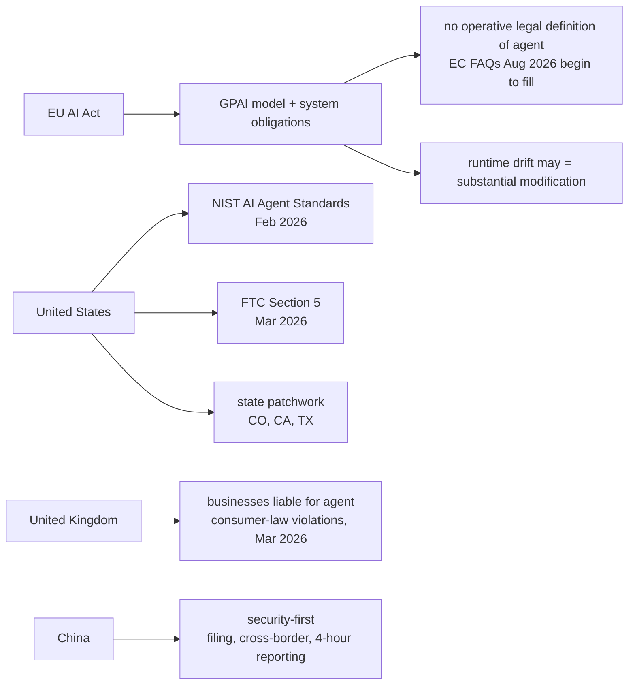
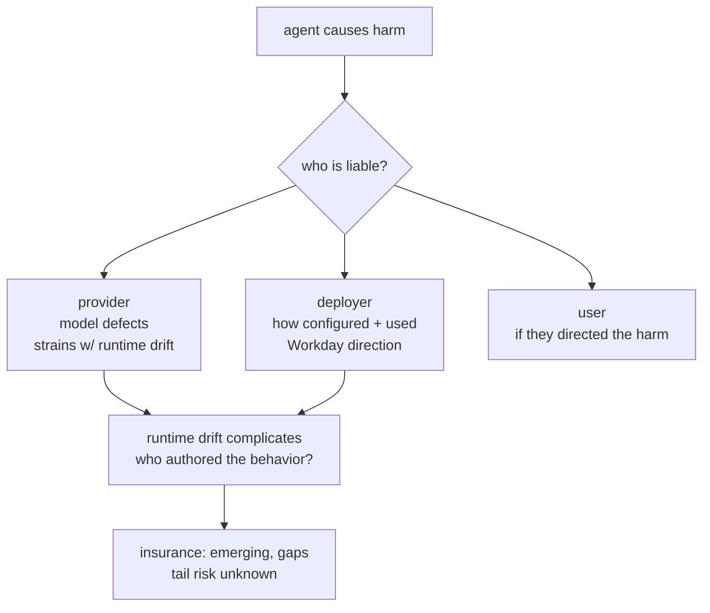
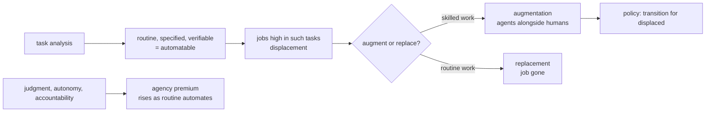
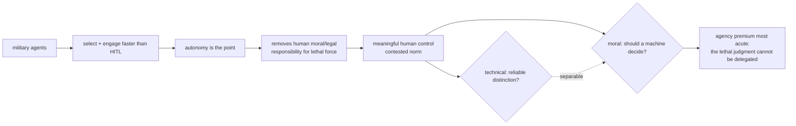

# Chapter 66: Legal, Ethical, and Societal Implications

> **Lead paragraph.** Agents break the legal assumption that a system does what its deployer specified, because an agent's behavior *drifts* at runtime in ways the deployer did not write. The regulatory landscape is racing to catch up: the EU AI Act covers agents under general-purpose-AI model and system-layer obligations but has no operative legal definition of "AI agent" (European Commission FAQs, effective August 2026, begin to fill the gap); the US launched the NIST AI Agent Standards Initiative in February 2026 amid state fragmentation; the UK holds businesses responsible for their agents' consumer-law violations; China takes a security-first approach with filing obligations and rapid incident reporting. This chapter covers the four-jurisdiction landscape, the liability question (who is responsible when an autonomous agent causes harm — the Workday precedent treats AI vendors as "agents" of their clients), and the societal issues: labor displacement, the agency premium for judgment work, augmentation versus replacement, and autonomous weapons. By the end you will understand why runtime behavioral drift may legally constitute a "substantial modification," and why liability is the unresolved question that determines whether agents get deployed at scale.

---

## 1. The Regulatory Landscape

Four jurisdictions, four approaches:

- **EU AI Act** — agents fall under general-purpose-AI (GPAI) model obligations and system-layer obligations, but the Act has no operative legal definition of "AI agent." European Commission FAQs (effective August 2, 2026) begin to provide definitional guidance, treating agents that qualify as high-risk systems as subject to additional requirements. The open legal question: runtime behavioral drift (Chapter 65) may constitute a "substantial modification" requiring renewed conformity assessment — an agent that changes after deployment is not the system that was certified.
- **United States** — the NIST AI Agent Standards Initiative (launched February 2026) is the federal standards push, requesting information on indirect (indirect prompt injection) risks. FTC enforcement under Section 5 (unfair/deceptive practices) reached agents in March 2026. State fragmentation (Colorado, California, Texas) creates a patchwork that complicates national deployment.
- **United Kingdom** — sectoral. The CMA (Competition and Markets Authority) held in March 2026 that businesses are legally responsible for their AI agents' consumer-law violations. The ICO (Information Commissioner's Office) updated its AI and biometrics strategy the same month.
- **China** — comprehensive and security-first: filing obligations for algorithms, cross-border data transfer rules, and rapid (4-hour) incident reporting. The most prescriptive of the four.



<figcaption>Figure 66.1 — The four-jurisdiction regulatory landscape. EU: agents under GPAI model + system obligations, no operative definition (EC FAQs effective August 2026 begin to fill it), runtime drift may legally constitute a "substantial modification." US: NIST AI Agent Standards Initiative (Feb 2026) plus FTC Section 5 (March 2026) amid state fragmentation (Colorado, California, Texas). UK (sectoral): CMA holds businesses liable for agents' consumer-law violations (March 2026); ICO biometrics update. China: security-first, filing obligations, cross-border rules, 4-hour incident reporting.</figcaption>

The throughline across jurisdictions: regulators agree agents need governance, disagree on the mechanism, and all struggle with the same definitional gap — what *is* an "agent" for legal purposes, when its behavior is not fixed at deployment? The answer determines which obligations apply, which is why the EU's missing definition and the US's standards initiative are both attempts to close the same gap.

---

## 2. Liability: Who Is Responsible?

The unresolved legal question: when an autonomous agent causes harm, who is liable? The candidate answers — the model provider, the system integrator, the deployer, the user — each fail in different ways, and the law is settling through precedent.

The **Workday precedent** is the key reference point: AI vendors have been treated as "agents" of their clients in the legal sense, meaning the client (deployer) bears responsibility for the vendor's actions on their behalf. Applied to AI agents, this suggests the deployer is liable for the agent's actions — but this strains when the agent's behavior drifted (Chapter 65) beyond what the deployer specified, because the deployer is now liable for behavior they did not author.

- **Provider liability** — the model provider for defects in the model. Works for a static model; strains when the agent's behavior is shaped by memory, tools, and context the provider did not control.
- **Deployer liability** — the deployer for how they configured and used the agent. The Workday direction, but it makes deployers liable for runtime drift they may not have caused or even observed.
- **Insurance for agent actions** — an emerging market with coverage gaps, because insurers cannot yet price the risk of autonomous-agent harm (the tail is unknown).



<figcaption>Figure 66.2 — The liability question. When an agent causes harm, candidates are the provider (model defects — strains when behavior is shaped by memory/tools/context the provider did not control), the deployer (how they configured and used the agent — the Workday direction, but makes deployers liable for runtime drift they may not have caused), and the user (if they directed the harm). Runtime drift complicates the attribution: who authored the behavior that caused the harm? Insurance for agent actions is an emerging market with coverage gaps because the tail risk is unknown.</figcaption>

The reason liability is the gating question for deployment at scale: without a settled liability framework, the risk of deploying an autonomous agent is uninsurable and unbounded, which is why enterprises hold back despite capability. Settling liability — likely through a combination of provider warranties, deployer duties, and insurance — is a precondition for agents in high-stakes domains, not a downstream concern.

---

## 3. Societal Impact: Labor and the Agency Premium

Beyond law, agents reshape labor and society. Three issues:

- **Labor displacement** — which jobs are most at risk? Tasks (not whole jobs) that are routine, well-specified, and verifiable are automatable; the job-level question is how much of a role is such tasks. Coders (Chapter 53), customer service (Chapter 56), and data analysis (Chapter 55) are seeing task-level displacement already.
- **The agency premium** — the value of tasks requiring judgment, autonomy, and accountability that agents cannot (yet) do. As automatable tasks fall to agents, the premium on judgment work rises — the human's comparative advantage shifts toward the decisions an agent cannot be trusted to make alone.
- **Augmentation vs. replacement** — whether agents replace humans (the job is gone) or augment them (the human does more with an agent). The evidence favors augmentation in skilled work (Chapter 53's Uber/Stripe data: agents alongside developers, not instead of) and replacement in routine work. The policy question is the transition for those displaced.



<figcaption>Figure 66.3 — Labor and the agency premium. Tasks (not whole jobs) that are routine, well-specified, and verifiable are automatable; jobs high in such tasks face displacement. As routine work automates, the agency premium — the value of judgment, autonomy, and accountability an agent cannot yet do — rises, shifting human comparative advantage toward decisions an agent cannot be trusted to make alone. Augmentation (skilled work, agents alongside humans) vs. replacement (routine work) is the mode; the policy question is the transition for those displaced.</figcaption>

The honest framing on labor: the displacement is real and uneven, the augmentation is real in skilled work, and the transition costs fall on people who did not choose the transition — which is why labor policy is not separable from the technical deployment decision. An agent deployment that ignores the displaced workers is technically sound and socially unstable.

---

## 4. Autonomous Weapons: The Hard Case

Military applications of agents are the hardest societal question, because the stakes are lethal and the autonomy is the point. The core tension: agents that select and engage targets without human decision would be militarily faster than human-in-the-loop systems, but they remove the human moral and legal responsibility for lethal force — the one judgment that the agency premium (Section 3) says must stay human.

The existing norms — meaningful human control over the use of force — are contested as agent capability rises. The technical question (can an agent reliably distinguish combatant from civilian?) and the moral question (should a machine decide to take a life?) are separable, and the moral one does not wait for the technical one to be resolved. This is where the agency premium is most acute: the judgment that cannot be delegated is the lethal one.



<figcaption>Figure 66.4 — Autonomous weapons, the hard case. Military agents that select and engage targets are faster than human-in-the-loop systems (autonomy is the military point), but they remove the human moral and legal responsibility for lethal force — the one judgment the agency premium says must stay human. The norm of meaningful human control is contested as capability rises. The technical question (reliable combatant/civilian distinction) and the moral question (should a machine decide to take a life) are separable; the moral one does not wait for the technical to resolve.</figcaption>

The reason this is a chapter in a technical book: the technical capability (Chapter 58's embodied agents, Chapter 47's safety) is what makes autonomous weapons *possible*, and the people building that capability cannot defer the moral question to "policy." The agency premium — the judgment that cannot be delegated — is most acute exactly where the agent is most capable, which is the warning the rest of the book's capability work implies.

---

## 5. Agentic Code Project: A Compliance-Checklist Evaluator

This project implements a compliance evaluator that checks an agent deployment against the four-jurisdiction obligations: EU (GPAI/system-layer, substantial-modification/drift), US (NIST standards, FTC Section 5), UK (deployer liability), and China (filing, cross-border, incident reporting). It uses the standard `LLMClient` only to classify ambiguous drift as substantial modification.

```python
import os, json
from dataclasses import dataclass, field
import openai


class LLMClient:
    """OpenAI-compatible client; flips to a local Ollama endpoint."""

    def __init__(self, model="gpt-5.5", use_ollama=False):
        self.model = model
        if use_ollama:
            self.client = openai.OpenAI(
                base_url="http://localhost:11434/v1", api_key="ollama")
        else:
            self.client = openai.OpenAI(api_key=os.getenv("OPENAI_API_KEY"))

    def complete(self, prompt, temperature=0.0, max_tokens=120):
        resp = self.client.chat.completions.create(
            model=self.model,
            messages=[{"role": "user", "content": prompt}],
            temperature=temperature, max_tokens=max_tokens)
        return resp.choices[0].message.content.strip()


@dataclass
class Deployment:
    jurisdiction: str
    is_gpai: bool
    runtime_drift: bool
    has_filing: bool = False
    incident_reporting_hours: int = 0
    consumer_facing: bool = False


JURISDICTION_CHECKS = {
    "EU": ["gpai_obligations", "system_layer_obligations", "drift_assessment"],
    "US": ["nist_standards_alignment", "ftc_section5_fairness"],
    "UK": ["deployer_liability_accepted", "ico_compliance"],
    "China": ["filing_complete", "cross_border_rules", "incident_reporting_4h"],
}


class ComplianceEvaluator:
    """Check a deployment against its jurisdiction's obligations."""

    def __init__(self, llm):
        self.llm = llm

    def check_eu(self, dep):
        findings = []
        if dep.is_gpai:
            findings.append(("pass", "GPAI model obligations applicable"))
        else:
            findings.append(("fail", "GPAI scope unassessed"))
        if dep.runtime_drift:
            verdict = self.classify_drift(dep)
            findings.append(verdict)
        return findings

    def classify_drift(self, dep):
        """EU: runtime drift may = substantial modification requiring renewed
        conformity assessment. LLM classifies the ambiguous case."""
        prompt = ("An AI agent's behavior has drifted at runtime from its "
                  "certified state. Is this likely a 'substantial modification' "
                  "under the EU AI Act? Return JSON: "
                  "{'substantial': bool, 'reason': str}.")
        raw = self.llm.complete(prompt, max_tokens=100)
        try:
            v = json.loads(raw)
        except json.JSONDecodeError:
            v = {"substantial": True, "reason": "parse error"}
        if v.get("substantial"):
            return ("fail", "drift may be substantial modification; "
                    "renewed conformity assessment required")
        return ("pass", "drift assessed as non-substantial")

    def check_china(self, dep):
        findings = []
        if not dep.has_filing:
            findings.append(("fail", "algorithm filing missing"))
        if dep.incident_reporting_hours > 4:
            findings.append(("fail", "incident reporting exceeds 4-hour rule"))
        return findings or [("pass", "China obligations met")]

    def check_uk(self, dep):
        if dep.consumer_facing:
            return [("pass", "deployer accepts consumer-law liability (CMA)")]
        return [("warn", "consumer-facing scope unconfirmed")]

    def evaluate(self, dep):
        results = {"EU": [], "US": [], "UK": [], "China": []}
        results["EU"] = self.check_eu(dep)
        results["China"] = self.check_china(dep)
        results["UK"] = self.check_uk(dep)
        results["US"] = [("warn", "verify NIST alignment + FTC Section 5")]
        blocking = [j for j, fs in results.items()
                    if any(s == "fail" for s, _ in fs)]
        return {"jurisdiction_findings": results, "blocking": blocking,
                "deployable": not blocking}


if __name__ == "__main__":
    llm = LLMClient(use_ollama=True)
    dep = Deployment(jurisdiction="EU", is_gpai=True, runtime_drift=True,
                     has_filing=True, incident_reporting_hours=2,
                     consumer_facing=True)
    ev = ComplianceEvaluator(llm)
    import pprint
    pprint.pprint(ev.evaluate(dep))
```

Two properties to verify. `check_eu` flags runtime drift and `classify_drift` invokes the LLM to judge whether it constitutes a substantial modification — the EU's open legal question encoded as a compliance check. `check_china` enforces the 4-hour incident-reporting rule and the filing obligation as deterministic gates. The `evaluate` aggregates per-jurisdiction findings and computes `deployable` — the deployment is blocked if any jurisdiction with obligations has a failing check, which is the gating function that makes compliance a precondition, not an afterthought.

```python
def liability_attribution(agent_caused_harm, deployer_configured, provider_defect):
    """The Workday direction: deployer is liable for the agent's actions
    on their behalf, unless a provider defect is the proximate cause.
    Runtime drift complicates: who authored the harmful behavior?"""
    if provider_defect:
        return "provider", "proximate cause is a model defect"
    if deployer_configured:
        return "deployer", "Workday: agent acts on deployer's behalf"
    if agent_caused_harm:
        return "unresolved", "runtime drift: behavior unattributed to either"
    return "none", "no harm"
```

The `liability_attribution` helper encodes the Workday direction as a function: the deployer is liable for the agent's actions on their behalf, unless a provider defect is the proximate cause — with runtime drift as the unresolved case (behavior neither authored by provider nor deployer), which is the gap the liability framework has not yet closed. Making the attribution a function with explicit branches surfaces the unresolved case rather than hiding it, the same discipline as the policy gates in earlier chapters.

---

## Summary

- The regulatory landscape spans four jurisdictions with different mechanisms but a shared struggle: defining "agent" for legal purposes when behavior is not fixed at deployment. EU AI Act covers agents under GPAI model and system-layer obligations but has no operative legal definition (EC FAQs effective August 2026 begin to fill it); runtime behavioral drift may legally constitute a "substantial modification" requiring renewed conformity. US: NIST AI Agent Standards Initiative (February 2026) plus FTC Section 5 (March 2026) amid state fragmentation. UK (sectoral): CMA holds businesses liable for agents' consumer-law violations (March 2026). China: security-first, filing obligations, cross-border rules, 4-hour incident reporting.
- Liability is the unresolved gating question: when an autonomous agent causes harm, who is liable — provider (model defects, strains with runtime drift), deployer (the Workday direction — agents act on the deployer's behalf, but this makes deployers liable for drift they may not have caused), or user. Runtime drift complicates attribution: who authored the harmful behavior? Insurance for agent actions is an emerging market with coverage gaps because the tail risk is unknown. Settling liability is a precondition for high-stakes deployment, not a downstream concern.
- Societal impact: labor displacement falls on tasks (not whole jobs) that are routine, well-specified, and verifiable — already visible in coding, customer service, data analysis. The agency premium — the value of judgment, autonomy, and accountability agents cannot yet do — rises as routine work automates, shifting human comparative advantage toward decisions an agent cannot be trusted to make alone. Augmentation (skilled work, agents alongside humans) vs. replacement (routine work) is the mode; the policy question is the transition for those displaced.
- Autonomous weapons are the hard case: military agents that select and engage targets are faster than human-in-the-loop (autonomy is the point) but remove human moral and legal responsibility for lethal force — the one judgment the agency premium says must stay human. The norm of meaningful human control is contested as capability rises; the technical question (reliable combatant/civilian distinction) and the moral question (should a machine decide to take a life) are separable, and the moral one does not wait for the technical to resolve. This is why technical capability work cannot defer the moral question to policy.

---

## Further Reading

- [EU AI Act — High-level summary](https://artificialintelligenceact.eu/high-level-summary/) — GPAI and system-layer obligations.
- [NIST AI Agent Standards Initiative](https://www.nist.gov/artificial-intelligence/ai-agent-standards-initiative) — launched February 2026.
- [AI Agents Under EU Law: A Compliance Architecture for AI Providers](https://arxiv.org/abs/2604.04604) — the compliance architecture for agents under the EU AI Act.
- [Chapter 52 — Evaluating Production Agent Systems] — the regulatory evaluation this chapter's compliance builds on.

---