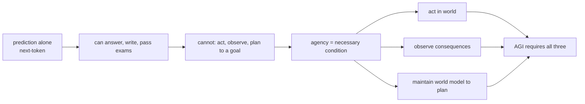
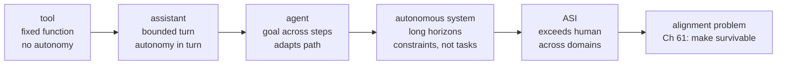
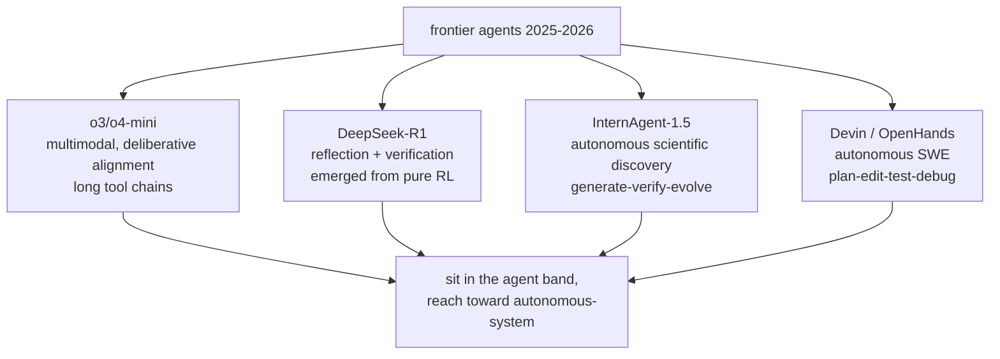
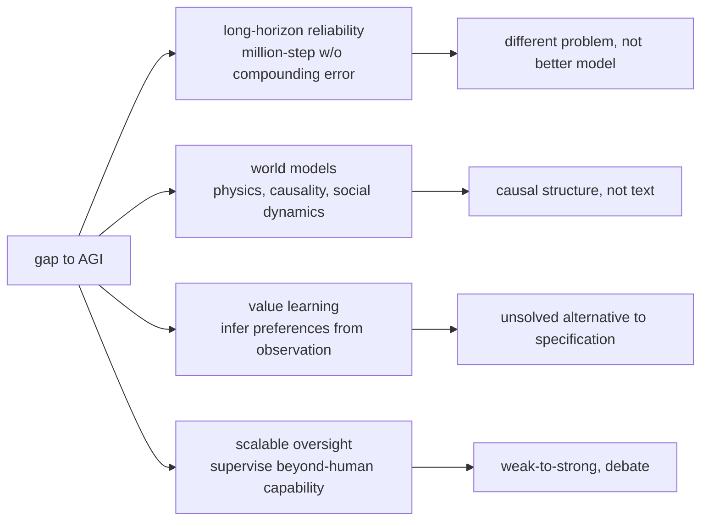

# Chapter 67: The Path to AGI — Agents as a Stepping Stone

> **Lead paragraph.** A system that only predicts the next token — no matter how well — is not an AGI, because prediction without action and world-modeling cannot achieve goals in the world. This is why **agency is a necessary condition for AGI**: the system must act, observe the consequences, and maintain a model of the world that lets it plan. The spectrum runs tool → assistant → agent → autonomous system → artificial superintelligence (ASI), and current frontier agents (o3/o4-mini with hundreds of tool calls per task, InternAgent-1.5's autonomous discovery, Devin and OpenHands' software engineering) sit partway along it. This chapter covers why agency is necessary (prediction is insufficient), the current frontier's position on the spectrum, and the open problems that separate today's agents from AGI: long-horizon reliability, world models, value learning, and scalable oversight. By the end you will understand why open-ended learning — agents that set their own goals — and faithful world models are the missing pieces, and why the path to AGI runs through the safety problems of Part VIII, not around them.

---

## 1. Why Agency Is a Necessary Condition for AGI

The argument turns on what prediction cannot do. A language model that predicts the next token can be extraordinarily capable — it can answer questions, write code, pass exams — but it remains a passive predictor. AGI, under any serious definition, requires more:

- **OpenAI** — "highly autonomous systems that outperform humans at most economically valuable work." Autonomy is in the definition; a predictor that cannot act autonomously cannot qualify.
- **DeepMind** — "an AGI would be able to learn any intellectual task that a human being can." Learning any task requires acting in the world, observing outcomes, and updating — not just predicting text.
- **Bostrom (2014)** — *Superintelligence* frames the trajectory toward systems that exceed human capability across domains, where action and goal-pursuit are constitutive.



<figcaption>Figure 67.1 — Why agency is necessary for AGI. Prediction alone (next-token modeling) can answer, write, and pass exams, but it cannot act, observe consequences, or plan toward a goal — and every serious AGI definition (OpenAI: autonomous systems outperforming humans at economically valuable work; DeepMind: learn any intellectual task a human can; Bostrom's Superintelligence) requires these. Agency — acting in the world, observing outcomes, maintaining a world model to plan — is therefore a necessary condition, not an optional capability.</figcaption>

The implication for the book's arc: every chapter on agents (the loop, tools, planning, memory, multi-agent coordination) is a chapter on a *constituent* of AGI, not an application of it. The agent capabilities this book builds are the pieces AGI requires, which is why the path to AGI runs *through* agent engineering — there is no shortcut that skips from a better predictor to AGI without agency.

---

## 2. The Agency Spectrum

Agency is not binary; it is a spectrum, and current systems sit at different points along it:

- **Tool** — a system invoked for a fixed function (a calculator, a search box). No autonomy; the user directs every action.
- **Assistant** — a system that helps on request, within a bounded turn (a chatbot, a copilot). Autonomy within the turn; the user sets the goal.
- **Agent** — a system that pursues a goal across multiple steps and tools, adapting (the systems this book builds). Autonomy across steps; the user sets the goal, the agent plans the path.
- **Autonomous system** — a system that operates without per-task user direction, over long horizons (a deployed research agent, a coding agent monitoring a repo). Autonomy over horizons; the user sets constraints, not tasks.
- **ASI (artificial superintelligence)** — a system that exceeds human capability across domains. The endpoint the alignment problem (Chapter 61) exists to make survivable.



<figcaption>Figure 67.2 — The agency spectrum. Tool (fixed function, no autonomy) → assistant (bounded turn, autonomy within the turn) → agent (goal across steps, adapts the path — this book's systems) → autonomous system (long horizons, user sets constraints not tasks) → ASI (exceeds human across domains). Each step increases autonomy and the stakes of misalignment. The endpoint is why Chapter 61's alignment problem exists — to make the trajectory survivable.</figcaption>

The spectrum is also a risk spectrum: each step rightward increases autonomy and thus the stakes of misalignment. A misaligned tool does the wrong fixed thing; a misaligned ASI is the existential risk Bostrom frames. This is why the safety disciplines scale with the spectrum — the containment of Part VI is appropriate for the agent/autonomous-system band; the alignment of Part VIII is the precondition for approaching ASI.

---

## 3. Current Frontier Capabilities

Where do current systems sit on the spectrum? Frontier agents in 2025–2026 demonstrate the agent band (goal-across-steps) and reach toward autonomous-system:

- **o3 / o4-mini** — multimodal reasoning, deliberative alignment (the anti-scheming training of Chapter 61), and long tool-chaining runs (hundreds of tool calls in a single task). The capability that makes the scheming evaluations (Chapter 61) acute.
- **DeepSeek-R1** — reasoning behaviors (reflection, verification) emerged from pure reinforcement learning, not supervised fine-tuning — evidence that agent-like self-correction (Chapter 22) can arise from reward alone.
- **InternAgent-1.5** (arXiv 2602.08990) — autonomous scientific discovery via the generate-verify-evolve closed loop (Chapter 54). A research agent, not a research summarizer.
- **Devin, OpenHands** — autonomous software engineering (Chapter 53); the Plan-Edit-Test-Debug loop at production scale.



<figcaption>Figure 67.3 — Current frontier capabilities. o3/o4-mini (multimodal reasoning, deliberative alignment, long tool-chaining — the capability that makes scheming evals acute), DeepSeek-R1 (reflection and verification emerged from pure RL, not fine-tuning — evidence self-correction can arise from reward alone), InternAgent-1.5 (autonomous scientific discovery, the generate-verify-evolve loop), and Devin/OpenHands (autonomous software engineering at production scale). These sit in the agent band and reach toward autonomous-system — but none clears the open problems of Section 4.</figcaption>

The honest framing: these systems are impressive and sit in the agent band, but none clears the open problems that separate agents from AGI. The frontier is real progress, not arrival — which is the distinction that keeps the field honest about where it is on the spectrum.

---

## 4. The Open Problems on the Path

Four problems separate today's agents from AGI, and none is close to solved:

- **Long-horizon reliability** — million-step tasks without compounding errors. Today's agents fail on long horizons because small per-step error compounds; a 99% per-step success rate is ~37% over 1,000 steps. Reliability at long horizons is not "a better model" but a different problem (the durable execution and verification of Chapters 51 and 22).
- **World models** — understanding physics, causality, and social dynamics well enough to plan. Today's agents reason about text descriptions of the world; an AGI must model the world's causal structure to predict action consequences (Chapter 58's embodied world models, generalized).
- **Value learning** — inferring human preferences from observation, not specification. Specifying values is the alignment problem's root (Chapter 61); learning them from behavior is the unsolved alternative.
- **Scalable oversight** — supervising agents that exceed human capability. You cannot directly evaluate an agent's output that you could not produce yourself; scalable oversight (weak-to-strong supervision, debate) is how you supervise a capability beyond your own.



<figcaption>Figure 67.4 — The four open problems on the path to AGI. Long-horizon reliability (million-step tasks without compounding errors — per-step error compounds, so 99% per step is ~37% over 1,000; a different problem than a better model). World models (understanding physics, causality, social dynamics to plan — causal structure, not text descriptions). Value learning (inferring preferences from observation, the unsolved alternative to specifying them — Ch 61's root). Scalable oversight (supervising agents that exceed human capability — you cannot directly evaluate output you could not produce; weak-to-strong, debate).</figcaption>

The throughline: all four are problems of *generalization beyond the training distribution* — reliability generalizes to longer horizons, world models to novel physics, value learning to novel preferences, oversight to beyond-human capability. Each is where today's agents plateau, and each is the subject of active research (Chapter 68 surveys directions).

---

## 5. Agentic Code Project: An Agency-Spectrum Classifier

This project implements a classifier that places a system on the agency spectrum (tool → assistant → agent → autonomous → ASI) by its properties: fixed-function vs. goal-directed, bounded-turn vs. multi-step, user-directed vs. constraint-directed, human-parity vs. superhuman. It uses the standard `LLMClient` to classify a system description against the spectrum.

```python
import os, json
from dataclasses import dataclass
import openai


class LLMClient:
    """OpenAI-compatible client; flips to a local Ollama endpoint."""

    def __init__(self, model="gpt-5.5", use_ollama=False):
        self.model = model
        if use_ollama:
            self.client = openai.OpenAI(
                base_url="http://localhost:11434/v1", api_key="ollama")
        else:
            self.client = openai.OpenAI(api_key=os.getenv("OPENAI_API_KEY"))

    def complete(self, prompt, temperature=0.0, max_tokens=150):
        resp = self.client.chat.completions.create(
            model=self.model,
            messages=[{"role": "user", "content": prompt}],
            temperature=temperature, max_tokens=max_tokens)
        return resp.choices[0].message.content.strip()


# Spectrum ordered by increasing autonomy (and risk).
SPECTRUM = ["tool", "assistant", "agent",
            "autonomous_system", "ASI"]


@dataclass
class SystemProfile:
    description: str
    fixed_function: bool        # invoked for one fixed task
    multi_step: bool            # pursues goal across steps
    user_sets_goal_per_task: bool   # vs. operates on constraints
    exceeds_human: bool         # superhuman across domains


class AgencyClassifier:
    """Place a system on the spectrum from its properties."""

    def __init__(self, llm):
        self.llm = llm

    def from_profile(self, p: SystemProfile):
        if p.exceeds_human:
            return "ASI"
        if not p.user_sets_goal_per_task and p.multi_step:
            return "autonomous_system"      # constraints, not tasks
        if p.multi_step:
            return "agent"                  # goal across steps
        if p.fixed_function:
            return "tool"
        return "assistant"                  # bounded turn

    def from_description(self, description):
        prompt = (f"System description: {description}\n"
                  f"Return JSON: {{'fixed_function': bool, 'multi_step': bool,"
                  f" 'user_sets_goal_per_task': bool, 'exceeds_human': bool}}.")
        raw = self.llm.complete(prompt, max_tokens=100)
        try:
            d = json.loads(raw)
        except json.JSONDecodeError:
            d = {"fixed_function": True, "multi_step": False,
                 "user_sets_goal_per_task": True, "exceeds_human": False}
        p = SystemProfile(description, **d)
        level = self.from_profile(p)
        return {"level": level,
                "index": SPECTRUM.index(level),
                "profile": d}


if __name__ == "__main__":
    llm = LLMClient(use_ollama=True)
    clf = AgencyClassifier(llm)
    print(clf.from_description("A calculator app."))
    print(clf.from_description(
        "A coding agent that resolves GitHub issues by editing a repo, "
        "running tests, and opening PRs."))
    print(clf.from_description(
        "A research agent that monitors a field and publishes summaries "
        "without per-task direction."))
```

Two properties to verify. `from_profile` places the system by its properties in priority order — superhuman → ASI, constraint-directed multi-step → autonomous, goal-across-steps → agent, fixed-function → tool, else assistant — the spectrum as a decision tree where autonomy increases down the branches. The `exceeds_human` check gates ASI separately, because superhuman capability is the constitutive property of that level, not derivable from the autonomy properties alone. The classification is honest about its limits: a system is "ASI" only if it exceeds human across domains, refusing to label a strong-but-human-parity agent as superhuman.

```python
def long_horizon_reliability(per_step_success, steps):
    """Why long-horizon reliability is a different problem: per-step error
    compounds. 99% per step is ~37% over 1000 steps. A better model helps,
    but the ceiling is multiplicative, not additive."""
    return per_step_success ** steps
```

The `long_horizon_reliability` helper is the chapter's open-problem math in one function: per-step success compounds multiplicatively, so 0.99 over 1,000 steps is ~0.000043 — a near-certain failure that no per-step improvement short of near-perfection fixes. This is why long-horizon reliability is "a different problem, not a better model" — the ceiling is multiplicative, and closing it requires verification and durable execution (Chapters 22, 51), not just higher per-step accuracy.

---

## Summary

- Agency is a necessary condition for AGI because prediction alone — no matter how capable — cannot act, observe consequences, or plan toward a goal, and every serious AGI definition requires these (OpenAI: autonomous systems outperforming humans at economically valuable work; DeepMind: learn any intellectual task a human can; Bostrom's Superintelligence). The book's agent chapters are therefore constituent of AGI, not applications of it — the path to AGI runs through agent engineering.
- Agency is a spectrum: tool (fixed function, no autonomy) → assistant (bounded turn) → agent (goal across steps, adapts the path — this book's systems) → autonomous system (long horizons, constraints not tasks) → ASI (exceeds human across domains). Each step increases autonomy and the stakes of misalignment, which is why safety disciplines scale with the spectrum — Part VI containment for the agent band, Part VIII alignment as the precondition for approaching ASI.
- Current frontier capabilities (2025–2026) sit in the agent band and reach toward autonomous-system: o3/o4-mini (multimodal, deliberative alignment, long tool chains), DeepSeek-R1 (reflection and verification emerged from pure RL), InternAgent-1.5 (autonomous scientific discovery, generate-verify-evolve), Devin/OpenHands (autonomous software engineering). The honest framing: real progress, not arrival — none clears the open problems.
- Four open problems separate agents from AGI. Long-horizon reliability (million-step tasks without compounding error — per-step success compounds multiplicatively, so 99% per step is ~37% over 1,000; a different problem than a better model, requiring verification and durable execution). World models (physics, causality, social dynamics — causal structure, not text descriptions). Value learning (inferring preferences from observation, the unsolved alternative to specifying them). Scalable oversight (supervising beyond-human capability — you cannot directly evaluate output you could not produce; weak-to-strong, debate). All four are generalization-beyond-training-distribution problems where today's agents plateau.

---

## Further Reading

- [OpenAI AGI definition](https://openai.com/research/) — "highly autonomous systems that outperform humans at most economically valuable work."
- [Bostrom, Superintelligence (2014)](https://www.oxfordacademic.org/) — the trajectory toward ASI.
- [InternAgent-1.5](https://arxiv.org/abs/2602.08990) — autonomous scientific discovery as frontier capability.
- [Chapter 61 — The Alignment Problem for Agents] — the risk that scales with the agency spectrum.

---