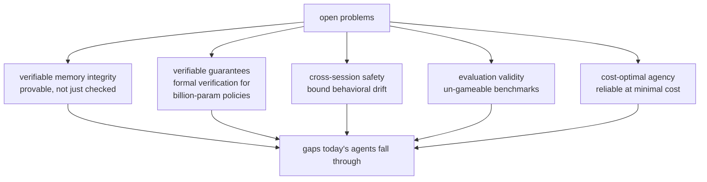
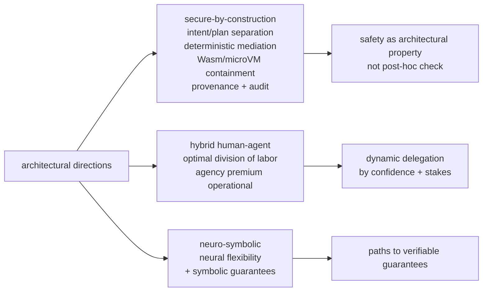
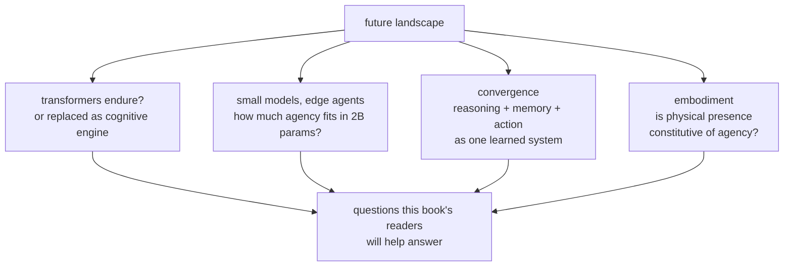
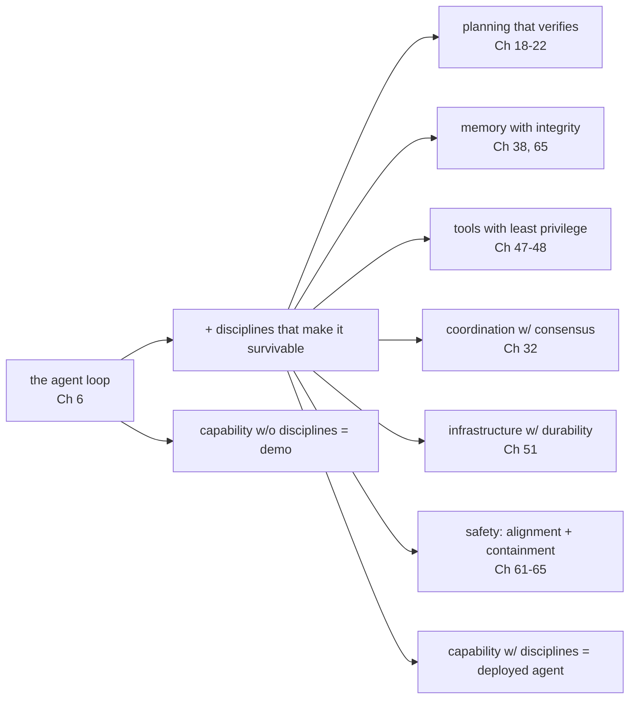

# Chapter 68: Open Problems and Future Directions

> **Lead paragraph.** This book built agents from the loop (Chapter 6) through planning, memory, multi-agent coordination, infrastructure, and domains to the safety problems of Part VIII. What remains? This synthesis chapter names the open problems the field has not solved, the architectural directions it is pursuing, and the future landscape it is entering. The technical open problems — verifiable memory integrity, formal guarantees for high-dimensional policies, cross-session safety, un-gameable evaluation, cost-optimal agency — are the gaps today's agents fall through. The architectural directions — secure-by-construction agents, hybrid human-agent systems, neuro-symbolic integration — are the bridges being built. And the future landscape — whether transformers endure, whether small models run agents at the edge, whether reasoning-memory-action converge, whether embodiment is required for true agency — is the open question this book's readers will help answer. By the end you will have a map of what is known, what is missing, and what comes next — the orientation a practitioner needs to contribute rather than merely use.

---

## 1. Technical Open Problems

Five problems remain unsolved, each a gap today's agents fall through:

- **Verifiable memory integrity** — Chapter 65 showed memory is treated as context, not state; the open problem is verifiable, tamper-proof agent memory — where integrity is provable, not merely checked. Append-only logs and checksums (Chapter 65) detect tampering; proving integrity *cryptographically*, in a way a third party can verify, is unsolved.
- **Verifiable guarantees** — formal verification for high-dimensional agent policies. We can verify a simple state machine; we cannot formally verify a billion-parameter policy. The gap between the guarantees we want (the agent will never do X) and the verification we can do (testing shows it did not do X in N cases) is the open problem.
- **Cross-session safety** — preventing behavioral drift (Chapter 65) over long deployments. An agent that is safe at deployment can drift unsafe over months; bounding drift is unsolved.
- **Evaluation validity** — designing benchmarks that cannot be gamed. Chapter 16's reward hacking and Chapter 53's SWE-bench contamination show benchmarks are gameable; an un-gameable benchmark is an open problem, because any metric can be optimized for rather than the intent.
- **Cost-optimal agency** — reliable outcomes at minimal compute cost (Chapter 50). The frontier is reliable but expensive; small models are cheap but unreliable. Closing the gap — reliable agency at minimal cost — is the open problem that determines whether agents deploy at scale.



<figcaption>Figure 68.1 — Five technical open problems. Verifiable memory integrity (provable, not merely checked — Ch 65 detects tampering; cryptographic third-party verifiability is unsolved), verifiable guarantees (formal verification for high-dimensional policies — we verify state machines, not billion-parameter models), cross-session safety (bound behavioral drift over long deployments), evaluation validity (un-gameable benchmarks — any metric can be optimized for rather than the intent), and cost-optimal agency (reliable outcomes at minimal cost — the frontier is reliable but expensive; small models are cheap but unreliable).</figcaption>

The common thread: each is a problem of *trust at scale*. A memory you cannot verify, a policy you cannot formally guarantee, a benchmark you cannot trust ungameable, an agent whose cost you cannot bound — these are the trust gaps that keep agents out of high-stakes deployment despite capability. Closing them is the precondition for the domains Part VII surveyed to deploy at the scale their capability implies.

---

## 2. Architectural Directions

Three directions are the bridges being built toward closing those gaps:

- **Secure-by-construction** — building safety in, not bolting it on. Four techniques: intent/plan separation (the user's intent and the agent's plan are distinct, auditable layers — so an injected plan is visible against the stated intent), deterministic policy mediation (a non-LLM layer enforces safety rules the model cannot override — Chapter 48's policy-as-code, hardened), contained execution (WebAssembly, microVMs — Chapter 47's sandboxing at the language/VM level), and provenance and audit (every action traceable to its origin — Chapter 49). Secure-by-construction treats safety as an architectural property, not a post-hoc check.
- **Hybrid human-agent systems** — the optimal division of labor between human and agent. Chapter 48's human-in-the-loop is the simplest form; the open direction is *which* decisions to delegate, dynamically, based on the agent's confidence and the stakes — the agency premium (Chapter 66) made operational.
- **Neuro-symbolic integration** — combining neural flexibility (learning, perception, language) with symbolic guarantees (verifiable reasoning, type safety, logical constraints). The neural part handles what scales; the symbolic part handles what must be provable. This is the path toward the verifiable guarantees of Section 1.



<figcaption>Figure 68.2 — Three architectural directions. Secure-by-construction (intent/plan separation, deterministic policy mediation, contained execution via WebAssembly/microVMs, provenance and audit — safety as an architectural property, not a post-hoc check), hybrid human-agent systems (the optimal division of labor — Chapter 48's HITL generalized to dynamic delegation by confidence and stakes, the agency premium made operational), and neuro-symbolic integration (neural flexibility for what scales + symbolic guarantees for what must be provable — the path toward verifiable guarantees).</figcaption>

The three compose: secure-by-construction contains the agent, hybrid systems bound its autonomy, and neuro-symbolic integration gives the parts that must be trustworthy a verifiable substrate. Together they are the architecture of an agent you could trust in high-stakes domains — which is the goal the open problems of Section 1 block.

---

## 3. The Future Landscape

Four questions frame the landscape the field is entering:

- **Will transformers endure?** — the transformer has been the cognitive engine of the agent revolution; the open question is whether it remains dominant or is replaced (by state-space models, by something new) as the foundation for agent reasoning. The bet either way shapes every architectural choice in this book.
- **Small models for edge agents** — Gemma, Phi, and similar small models can run agents on-device (edge agents), trading frontier capability for latency, privacy, and cost. The open question is how much agency small models can carry — whether the loop, tools, and planning of Chapters 6–22 fit in a 2B-parameter model.
- **Convergence of reasoning, memory, and action** — today these are separate modules (the planner, the memory store, the tool interface); next-generation architectures may converge them into a single learned system that reasons, remembers, and acts as one. The architectural separation this book taught may be a scaffold, not the final form.
- **The role of embodiment** — does true agency require physical presence? Chapter 58's embodied agents are one answer; the open question is whether disembodied agents (software-only) can reach full agency, or whether grounding in physical consequence is constitutive of it.



<figcaption>Figure 68.3 — The future landscape. Will transformers endure as the cognitive engine, or be replaced (state-space models, something new) — the bet shapes every architectural choice. Small models for edge agents (Gemma, Phi — how much of the loop/tools/planning fits in a 2B model, trading capability for latency/privacy/cost). Convergence of reasoning, memory, and action (today separate modules; next-gen architectures may unify them — the separation this book taught may be a scaffold, not the final form). The role of embodiment (does true agency require physical presence, or can disembodied software agents reach full agency?).</figcaption>

The honest framing on the future: these are open questions, not predictions. The field does not know whether transformers endure, how much agency small models carry, whether the modules converge, or whether embodiment is required — and the practitioner who treats any as settled will be surprised. The contribution this book aims to enable is informed work on these questions, which requires holding them as open.

---

## 4. The Synthesis: What This Book Taught

Stepping back, the book's arc has a shape worth naming. Part I (Foundations) established what an agent is — the loop, the model, memory, tools. Parts II–III (Single-Agent, Planning) built the agent's reasoning. Parts IV–V (Multi-Agent, Memory) built its coordination and persistence. Part VI (Infrastructure) built its production containment. Part VII (Domains) showed where it works. Part VIII (Safety) showed where it can fail, and why trust is the gating capability.

The throughline: **an agent is the loop (Chapter 6) plus the disciplines that make it survivable** — planning that verifies, memory with integrity, tools with least privilege, multi-agent coordination with consensus, infrastructure with durability, and safety with alignment and containment. Capability without these disciplines is a demo; capability with them is a deployed agent. The open problems of this chapter are where the disciplines are incomplete, and the future directions are where they are being extended.



<figcaption>Figure 68.4 — The book's synthesis. An agent is the loop (Chapter 6) plus the disciplines that make it survivable: planning that verifies (Ch 18–22), memory with integrity (Ch 38, 65), tools with least privilege (Ch 47–48), coordination with consensus (Ch 32), infrastructure with durability (Ch 51), and safety as alignment plus containment (Ch 61–65). Capability without these disciplines is a demo; capability with them is a deployed agent. The open problems of this chapter are where the disciplines are incomplete; the future directions are where they are being extended.</figcaption>

The closing claim: the difference between the agents of 2023 (impressive demos) and the agents of 2026 (production deployments, Chapter 53) was not primarily capability — it was the maturation of these disciplines. The difference between the agents of 2026 and trustworthy agents in high-stakes domains will be the same: not raw capability, but the closing of the open problems and the maturation of the architectural directions this chapter surveyed.

---

## 5. Agentic Code Project: An Open-Problem and Direction Tracker

This final project is a tracker that maps a given agent system to the open problems it touches and the architectural directions it embodies — a self-assessment tool for where a system stands against the field's frontier. It uses the standard `LLMClient` to classify a system description against the open problems and directions.

```python
import os, json
from dataclasses import dataclass, field
import openai


class LLMClient:
    """OpenAI-compatible client; flips to a local Ollama endpoint."""

    def __init__(self, model="gpt-5.5", use_ollama=False):
        self.model = model
        if use_ollama:
            self.client = openai.OpenAI(
                base_url="http://localhost:11434/v1", api_key="ollama")
        else:
            self.client = openai.OpenAI(api_key=os.getenv("OPENAI_API_KEY"))

    def complete(self, prompt, temperature=0.0, max_tokens=250):
        resp = self.client.chat.completions.create(
            model=self.model,
            messages=[{"role": "user", "content": prompt}],
            temperature=temperature, max_tokens=max_tokens)
        return resp.choices[0].message.content.strip()


OPEN_PROBLEMS = [
    "verifiable_memory_integrity", "verifiable_guarantees",
    "cross_session_safety", "evaluation_validity", "cost_optimal_agency",
]

DIRECTIONS = [
    "secure_by_construction", "hybrid_human_agent",
    "neuro_symbolic", "edge_small_models", "reasoning_memory_action_convergence",
]


@dataclass
class SystemAssessment:
    description: str
    open_problems_touched: list = field(default_factory=list)
    directions_embodied: list = field(default_factory=list)
    notes: str = ""


class FrontierTracker:
    """Map a system to the open problems it touches and directions it
    embodies — a self-assessment of where it stands against the field."""

    def __init__(self, llm):
        self.llm = llm

    def assess(self, description):
        prompt = (f"Agent system description: {description}\n\n"
                  f"Open problems: {OPEN_PROBLEMS}\n"
                  f"Directions: {DIRECTIONS}\n"
                  f"Return JSON: {{'open_problems_touched': [str], "
                  f"'directions_embodied': [str], 'notes': str}}. "
                  f"List only those genuinely relevant.")
        raw = self.llm.complete(prompt, max_tokens=250)
        try:
            d = json.loads(raw)
        except json.JSONDecodeError:
            d = {"open_problems_touched": [], "directions_embodied": [],
                 "notes": "parse error"}
        return SystemAssessment(description, **d)

    def gap_report(self, assessment):
        """Which open problems are NOT addressed = the system's gaps."""
        addressed = set(assessment.open_problems_touched)
        gaps = [p for p in OPEN_PROBLEMS if p not in addressed]
        return {"addressed": sorted(addressed), "gaps": gaps}


if __name__ == "__main__":
    llm = LLMClient(use_ollama=True)
    tracker = FrontierTracker(llm)
    desc = ("A production coding agent with durable workflow replay, "
            "append-only memory with checksums, sandboxed tool execution in "
            "microVMs, policy-as-code mediation, and a 3B-parameter model "
            "for cost control.")
    a = tracker.assess(desc)
    print("touched:", a.open_problems_touched)
    print("embodies:", a.directions_embodied)
    print("gaps:", tracker.gap_report(a))
```

Two properties to verify. `assess` maps the system to the open problems it touches and directions it embodies — the self-assessment that tells a practitioner where their system stands. `gap_report` computes the *complement* — which open problems are not addressed — because the gaps, not the strengths, are what determines whether the system is ready for high-stakes deployment. The discipline of computing the gap (not just the strengths) is the anti-sycophancy principle applied to one's own system: report what is missing, not only what is present.

```python
def trust_gating(open_problems_addressed, total_open_problems):
    """The book's closing claim operationalized: high-stakes deployment is
    gated not on capability but on the disciplines (open problems addressed).
    Returns the fraction of disciplines in place — the trust ceiling."""
    return len(open_problems_addressed) / max(total_open_problems, 1)
```

The `trust_gating` helper is the book's closing claim as a function: high-stakes deployment is gated not on capability but on the disciplines in place — the fraction of open problems addressed is the trust ceiling, and a system below it is not deployable in high-stakes domains regardless of capability. This is the synthesis the whole book argues: capability gets you to the demo; the disciplines get you to deployment.

---

## Summary

- Five technical open problems remain unsolved: verifiable memory integrity (provable, not merely checked — Ch 65 detects tampering; cryptographic third-party verifiability is unsolved), verifiable guarantees (formal verification for high-dimensional policies — we verify state machines, not billion-parameter models), cross-session safety (bound behavioral drift over long deployments), evaluation validity (un-gameable benchmarks — any metric can be optimized for rather than the intent), and cost-optimal agency (reliable outcomes at minimal cost — frontier is reliable but expensive, small models cheap but unreliable). Each is a trust gap that keeps agents out of high-stakes deployment despite capability.
- Three architectural directions bridge the gaps: secure-by-construction (intent/plan separation, deterministic policy mediation, contained execution via WebAssembly/microVMs, provenance and audit — safety as an architectural property, not a post-hoc check), hybrid human-agent systems (the optimal division of labor — dynamic delegation by confidence and stakes, the agency premium made operational), and neuro-symbolic integration (neural flexibility for what scales + symbolic guarantees for what must be provable — the path to verifiable guarantees).
- The future landscape holds four open questions: will transformers endure as the cognitive engine or be replaced; how much agency can small models carry for edge deployment; will reasoning, memory, and action converge into a single learned system (the modular separation this book taught may be a scaffold, not the final form); and does true agency require physical embodiment. These are open questions, not predictions — treating any as settled invites surprise.
- The book's synthesis: an agent is the loop (Chapter 6) plus the disciplines that make it survivable — planning that verifies, memory with integrity, tools with least privilege, coordination with consensus, infrastructure with durability, safety as alignment and containment. Capability without these is a demo; with them, a deployed agent. The difference between 2023's demos and 2026's production deployments was the maturation of these disciplines, not raw capability — and the difference between 2026 and trustworthy high-stakes agents will be the same: closing the open problems, maturing the directions, not chasing capability alone.

---

## Further Reading

- [Chapter 65 — Memory Integrity] — the open problem of verifiable memory.
- [Chapter 61 — The Alignment Problem] — the open problem of scalable oversight and value learning.
- [Chapter 47 — Security, Sandboxing, and Governance] — the secure-by-construction substrate.
- [Chapter 67 — The Path to AGI] — the trajectory these open problems gate.

---